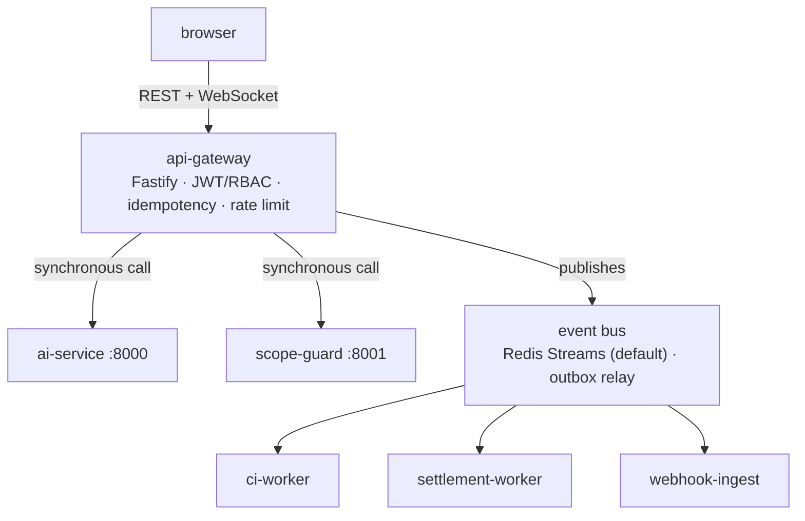

# Architecture

How AssureCode is put together and why. For measured results (matchmaking,
scope-guard accuracy, benchmark latencies) see
[docs/plan2.md](docs/plan2.md)'s "known functional gaps" and
[docs/benchmarks/](docs/benchmarks/); for the attacker model see
[docs/THREAT_MODEL.md](docs/THREAT_MODEL.md).

## The problem

Freelance platforms settle disputes with ratings — a number produced by one
party about another, with no way for a third party to re-derive it. AssureCode
replaces the rating with a set of measurements that can be recomputed from
evidence: what the contract said when it was locked, what code was actually
submitted, what an audit found, and whether a deterministic gate approved
release.

Everything in the design follows from one requirement: **a third party who did
not observe the transaction must be able to check the outcome.**

## Service topology



`ci-worker`, `settlement-worker` and `webhook-ingest` have no inbound API from
the browser. They are event consumers, which is what lets the gateway stay a
thin request/response surface while audit and settlement run on their own
schedule.

## Data flow, phase by phase

**1 — Contract initialisation.** The gateway writes the contract, embeds its
requirements into pgvector, and appends the first `merkle_ledger` row. That
row's `previous_hash` is the literal `GENESIS` sentinel; its `current_hash` is
`H0`, the identifier for "the contract as originally locked". Publishes
`contract.initialized`, then `contract.locked`.

**2 — Verification.** A push (`code.push.received`) puts work on the bus.
`ci-worker` builds an isolated workspace and runs three checks: a Babel AST
maintainability pass, a generated test suite, and a dual-layer OWASP scan
(static rules plus an LLM layer in `ai-service`). Emits `ci.ast.completed`,
`ci.tests.completed`, `security.scan.completed`, then `audit.completed`.

**3 — Scope.** Chat messages go to `scope-guard`, which retrieves the contract
chunks and decides whether the request is inside what was agreed. Every decision
is anchored to `H0` — the guard judges against the contract *as hashed*, not as
the text reads today, so the decision stays checkable afterwards. If `H0` cannot
be resolved the guard refuses rather than degrading into a free-floating
similarity check. Emits `scope.checked`.

**4 — Scoring.** `settlement-worker` responds to `audit.completed` by calling
the gateway's `GET /api/contracts/:id/score`, which has `ai-service` compute an
explainable trust score from the audit signals and emits `xai.scored`. The
worker consumes that in turn, so the pipeline closes without a human.

That callback is the whole point of the step. Until it existed the only caller
of `/score` was a React effect, so the `trustScore >= 85` half of the settlement
gate could be satisfied only while somebody had the XAI tab open in a browser —
an audit nobody looked at could never settle. `ENABLE_AUTO_SCORING=false` is the
kill switch, and reinstates exactly that manual state.

**5 — Settlement.** `settlement-worker` asks `packages/oracle` for a verdict and
captures the escrow only if approved. Emits `settlement.completed` or
`settlement.rejected`.

**6 — Sealing.** After a settlement commits, `settlement-worker` computes the
Merkle root over the contract's chain and asks the gateway to sign it with
ML-DSA-87. The signer lives in `ai-service` because that is the only service
carrying an ML-DSA implementation (`dilithium-py`); every service that seals or
settles is TypeScript, and there is no JavaScript ML-DSA in the tree. A signing
failure is loud but not fatal — the money has already moved, and
`GET /api/contracts/:id/root` reports the root as unsigned rather than letting
the UI assert a signature that is not there.

Topics are declared once in `packages/shared/src/index.ts` (`EVENT_TOPICS`), so
producer and consumer cannot drift apart by string literal. Several topics are
published with no consumer — `contract.initialized`, `contract.locked`,
`tests.generated`, `settlement.completed`, `settlement.rejected`. That is
deliberate: they are fan-out points, and the two that travel via the
transactional outbox are durable whether or not anyone listens. Which topics
those are, and why, is recorded next to the constants themselves rather than
left to be re-derived by grep.

## Design decisions worth stating

### The settlement gate has exactly one definition

`packages/oracle` is a package rather than a module inside the settlement worker
because two services need the verdict: the worker acts on it, the gateway
reports it to the UI. A second copy of `evaluate()` in the gateway would be a
second definition of the money-releasing gate, free to drift from the one that
actually releases money. The gateway only ever reads.

The gate is `trustScore >= 85 && criticalVulns === 0` plus four CI booleans —
six signals. A missing `oracle_state` row is not a permissive default: with no
row every boolean is false, the score is null, and the contract is blocked with
blockers explaining why. `null` means "not yet scored" and must block; an
unscored contract is not a contract that scored well.

### Oracle state lives with the contract

The signals used to live in a module-level `Map`. A restart between the audit
and the settlement request silently reset every signal, so the contract could
never settle; and with more than one replica each process saw only the events
its own subscription received, so whether a contract settled depended on which
worker got which message. Oracle state is a property of the contract, so it is
stored with the contract.

The scope signal is deliberately **not** stored — it is derived from
`scope_checks` on every read, because a stored copy can disagree with the
decisions it summarises, and a previous version did exactly that.

### The ledger is canonicalised before hashing

`packages/ledger-client` serialises payloads with RFC 8785 (JSON Canonicalization
Scheme) before hashing, and builds RFC 6962 Merkle trees with domain separation
between leaf and interior nodes. Without canonicalisation, two semantically
identical payloads with different key order hash differently and the chain
cannot be re-derived by anyone else — which defeats the point.

Each row's hash, computed in Postgres over the canonical JSON:

$$H_k = \operatorname{SHA256}\big(C(P_k) \mathbin{\Vert} \texttt{\\n} \mathbin{\Vert} H_{k-1}\big), \qquad H_0 = \texttt{'GENESIS'}$$

where $C(\cdot)$ is the JCS serialization. `append_ledger` takes this as
**TEXT**, not JSONB — binding it as JSONB would let Postgres re-render it,
producing different bytes and therefore a different hash. The canonical string
is stored alongside the JSONB in `payload_canonical`, with a CHECK constraint
(`payload_canonical::jsonb = payload`) so the bytes that were hashed cannot
silently diverge from the queryable payload.

Merkle leaves and nodes follow RFC 6962: `leaf(d) = SHA256(0x00 ‖ d)`,
`node(l,r) = SHA256(0x01 ‖ l ‖ r)`, promoting odd nodes rather than duplicating
them (avoiding CVE-2012-2459). Roots are signed with FIPS 204 ML-DSA-87 via
`dilithium-py` (2592-byte public key, 4896-byte private key, 4627-byte
signature), deterministically derived from a seed with the context string
`assurecode/merkle-root/v1` for domain separation.

**Threat model, stated plainly:** the ledger is tamper-*evident*, not
tamper-*proof* — against an adversary who can write to `merkle_ledger` but does
not hold the ML-DSA private key. Such an adversary can mutate rows; they cannot
produce a chain that re-verifies, nor a valid signature over the resulting
root. An adversary holding the signing key is outside this model.
`verify_root` requires the caller to supply the expected public key — there is
no mode that verifies against a key stored next to the signature, which would
verify nothing.

17 rows predate this migration and are reported `unverifiable` rather than
assumed good.

### Delivery is transactional, not best-effort

State changes and their events are written in the same database transaction, to
an `outbox` table; `OutboxRelay` pumps that table onto the bus. A publish that
happens outside the transaction can succeed while the transaction rolls back, or
vice versa, and either produces a system whose events do not describe its state.

`RedisStreamsBus` uses consumer groups with bounded retries and a `*.dlq` stream
for poison messages, so a permanently failing handler cannot block a partition
forever.

### Untrusted code runs behind a sandbox seam

`ci-worker` executes freelancer code through a `SANDBOX_RUNNER` port with two
implementations. `DockerSandbox` is the stronger boundary but needs the host
Docker socket mounted — root-equivalent access on the node, handed to the
service whose entire job is executing untrusted code. The Kubernetes manifests
therefore pin `node`, which uses the Node permission model: weaker isolation, and
`infra/k8s/07-ci-worker.yaml` documents it as a deliberate trade with an upgrade
path rather than leaving it implicit.

An egress guard blocks network access from audited code.

### Idempotency is enforced at two layers

A bounded, TTL'd in-process cache (a plain `Map`, evicted oldest-inserted-first
— FIFO, not LRU: it never reorders on read) in front of a Postgres
`idempotency_keys` table. The database is what makes it correct across
replicas and restarts; the cache is what keeps it cheap. Razorpay webhook
redelivery is deduplicated separately by a unique index on `provider_event_id`,
inserted-then-checked so two concurrent redeliveries cannot both pass a
read-first check.

### Database TLS pins a CA rather than disabling verification

`packages/config/src/db.ts` trusts `infra/certs/supabase-ca-bundle.crt` with
`rejectUnauthorized: true`, and documents the fingerprint for out-of-band
verification — instead of the `rejectUnauthorized: false` that normally appears
at this point in a project.

## Data plane

- **PostgreSQL 17.6 + pgvector 0.8.2** — the system of record. 21 forward-only
  migrations, `V001__init.sql` … `V021__score_retry_cap.sql`, applied by
  `tools/migrate.ts`. No ORM: raw parameterised queries in both TypeScript and
  Python. No down-migrations (`V016` drops the `jobs` table outright once it
  was superseded, rather than ever needing to be rolled back).
- **Redis** — event bus streams and consumer groups.
- **LocalStack S3** — artifact storage (test bundles). The local-disk fallback is
  opt-in and off in production, because with multiple replicas a disk write
  succeeds and then the artifact cannot be found by any other pod.
- **Neo4j** — a **selectable alternative** to Postgres for the matchmaking
  graph, chosen with `GRAPH_BACKEND=neo4j`. Postgres remains the default.

  It was until recently provisioned but never queried: `get_graph_repo()` had no
  Neo4j branch, and `Neo4jGraphRepo.retrieve_by_embedding` was a stub returning
  similarity `0.0` for every freelancer — so selecting it would have deleted the
  semantic half of matchmaking without erroring. It now uses Neo4j's native
  vector index (`db.index.vector.queryNodes`), seeded by
  `tools/seed-neo4j-vectors.py`, which is a separate step from the structural
  seed and is what creates the 384-dimension cosine index.

  **The two backends do not report similarity on the same scale.** pgvector's
  `1 - (a <=> b)` is raw cosine in `[-1, 1]`; a Neo4j cosine index returns
  `(1 + cos) / 2` in `[0, 1]`. Both are plausible floats that survive the
  matchmaker's `max(0.0, …)` clamp, so mixing them up changes rankings without
  raising anything. `neo4j_score_to_cosine` inverts it, and a cross-backend
  parity test asserts both backends return the same top-k ordering *and*
  matching similarity values for the same query.

  Whether Neo4j is worth using is a separate question from whether it works: the
  matchmaker performs **no traversal**. It calls one method and reranks flat
  scalars in Python, which Postgres+HNSW serves at least as well. The graph
  structure the seed builds — `(Freelancer)-[:COMPLETED]->(Project)-[:REQUIRES]->(Skill)`
  — is what would justify it, and nothing walks those edges yet.

## Data model

19 tables across the Postgres migrations (20 created, `jobs` later dropped by
`V016` once superseded):

| Table | Purpose |
|---|---|
| `contracts` | Core contract registry |
| `merkle_ledger` | Tamper-evident hash chain |
| `merkle_roots` | Per-contract Merkle roots and ML-DSA signatures |
| `rag_embeddings` | 384-D HNSW vector store |
| `scope_checks` | Recorded scope decisions (drift detector input) |
| `escrow` | Razorpay escrow payments (amounts in paise) |
| `settlements` | Settlement records (single-fire guard, payout state) |
| `oracle_state` | Durable oracle state (was an in-process `Map`) |
| `audit_results` | CI telemetry and trust-score inputs |
| `idempotency_keys` | Gateway request reservation |
| `outbox` | Transactional outbox for the event bus |
| `users`, `freelancer_profiles` | Identity and matchmaking profile data (`V010`) |
| `payment_events` | Audit log of money-movement events (`V010`) |
| `kyc_verifications` | KYC decisions (stub adapter — see `THREAT_MODEL.md` T9) |
| `user_sessions`, `auth_providers`, `mfa_credentials`, `security_audit_logs` | Session revocation, OAuth, MFA, audit trail (`V011`, `V020`) |

The two tables that carry the ledger's own integrity constraint:

```sql
CREATE TABLE contracts (
    contract_id          TEXT PRIMARY KEY,
    client_id            TEXT NOT NULL DEFAULT 'anonymous',
    freelancer_id        TEXT NULL,
    title                TEXT NOT NULL,
    requirements         TEXT NOT NULL,
    pdf_raw_text          TEXT NULL,
    budget_cents         INTEGER NOT NULL,
    deadline             DATE NOT NULL,
    status               TEXT NOT NULL DEFAULT 'DRAFT'
                         CHECK (status IN ('DRAFT','LOCKED','IN_PROGRESS','COMPLETED','DISPUTED')),
    hidden_tests_s3_key   TEXT NULL,
    github_repo_full_name TEXT NULL,      -- V015
    created_at           TIMESTAMPTZ NOT NULL DEFAULT now()
    -- plus FK constraints to `users` added in V012
);

CREATE TABLE merkle_ledger (
    ledger_id         BIGSERIAL PRIMARY KEY,
    contract_id       TEXT NOT NULL REFERENCES contracts(contract_id) ON DELETE CASCADE,
    action_type       TEXT NOT NULL,
    payload           JSONB NOT NULL,
    payload_canonical TEXT NULL,          -- V009: the RFC 8785 bytes that were hashed
    hash_version      SMALLINT NOT NULL DEFAULT 1,
    previous_hash     TEXT NOT NULL DEFAULT 'GENESIS',
    current_hash      TEXT NOT NULL,
    created_at        TIMESTAMPTZ NOT NULL DEFAULT now(),
    CHECK (payload_canonical IS NULL OR payload_canonical::jsonb = payload)
);
```

Rows written before `V009` carry `hash_version = 1` and no canonical payload;
`verifyChainDetailed()` reports them as **unverifiable** — a state distinct
from both *verified* and *failed*. Recomputing their hashes under the current
formula would make them all "verify" and would destroy the property the ledger
exists for, since recomputation is exactly what rewriting history looks like.

## Algorithms & formulas

**Freelancer ranking** (`apps/ai-service/app/services/matchmaker.py`):
$$\text{Score} = 0.50\cdot\cos(\mathbf u,\mathbf v) + 0.35\cdot\text{TrustScore} + 0.15\cdot\text{CompletionRate}$$
Embeddings are L2-normalized, so cosine reduces to a dot product. These weights
were ablated over all 231 simplex settings; the shipped split ranks 66th of 231
against pure retrieval. That's expected, not a bug — trust and completion rate
are properties of the freelancer, not the query, so they reorder a domain
match but can't sharpen it, and the product deliberately ranks *who should be
hired*, not *who is most textually similar*.

**Maintainability index** (`apps/ci-worker/src/ast-analyzer.ts`), implemented
exactly as published, from a real Babel AST traversal (no control-flow graph is
built; cyclomatic complexity $M = 1 + \sum d(n)$ over decision-point nodes is
cited as the standard equivalent, not derived from one):
$$\text{MI} = \max\!\left(0,\ \frac{171 - 5.2\ln V - 0.23M - 16.2\ln L}{171}\times 100\right)$$

**Scope decision threshold** (`apps/scope-guard`):
$$\text{allowed} \iff \max_{r\in R_c}\cos(e(m),r) \ge \tau,\qquad \tau = 0.3056$$
Measured, not chosen — `tools/calibrate_scope_threshold.py` sweeps it against
the real ingest-and-retrieve path, split by contract, minimizing
$3\cdot\text{FN}+\text{FP}$ (a false allow costs more than a false block for a
payment system). See `docs/plan2.md`'s known gaps for the held-out accuracy
this actually achieves.

**Cumulative scope drift** (`apps/scope-guard/app/services/drift_detector.py`)
— per-message thresholding can't catch incremental creep by construction, so
residuals accumulate via CUSUM (Page, 1954) and are tested against a conformal
$p$-value / test martingale (Vovk, 2003), which by Ville's inequality (1939) is
anytime-valid — bounded false-alarm rate at any stopping time, distribution-free:
$$S_t=\max(0,\,S_{t-1}+(s_t-\kappa)), \qquad M_t=\prod_{i\le t}\varepsilon\,p_i^{\varepsilon-1},\ \text{alarm when } M_t>1/\delta$$
The detector refuses to construct without real calibration residuals rather
than invent a default — the shipped calibration set is synthetic and every
response using it says so (`SCOPE_DRIFT_CALIBRATION_SYNTHETIC`).

**Trust score** (`apps/ai-service`), an interpretable-by-design linear model,
not post-hoc attribution — each term reports its own input, weight and
contribution, and a term with no measured input is excluded and the rest
renormalized rather than defaulted:
$$T = 0.40\,S_{\text{test}} + 0.25\,S_{\text{maint}} + 0.20\,S_{\text{sec}} + 0.15\,S_{\text{scope}}, \qquad T\in[0,100]$$

**OWASP penalty** (`apps/ci-worker/src/security-auditor.ts`) — note
$N_{\text{total}}$ includes the critical/high findings already charged, so one
critical finding costs 45 points, not 40. Documented rather than silently
"corrected," since fixing it would change every historical score:
$$S_{\text{sec}} = \max(0,\ 100 - 40N_{\text{critical}} - 20N_{\text{high}} - 5N_{\text{total}})$$

## Observability

`packages/telemetry` provides OpenTelemetry tracing (OTLP/gRPC, with
Fastify/HTTP/pg/ioredis auto-instrumentation) and `prom-client` metrics.
Correlation ids propagate through AsyncLocalStorage into HTTP headers, log lines
and event envelopes, and W3C trace context rides in the event envelope so
consume spans hang off the publish span across the bus.

Metrics deliberately exclude `contract_id` as a label — an unbounded label is a
cardinality explosion, and per-contract data belongs in traces.

`infra/docker-compose.yml` and `infra/k8s/15-observability.yaml` run an OTel
collector, Jaeger, Prometheus and Grafana. All six services expose `/metrics`:
`api-gateway`, `webhook-ingest`, `ci-worker` and `settlement-worker` via
`packages/telemetry` (prom-client — the two workers via a dedicated
`startMetricsServer()` rather than piggybacking on a request-serving HTTP
server, since neither runs one), and `ai-service`/`scope-guard` via
`app/ports/telemetry.py` (prometheus_client), which shares the `assurecode_*`
name prefix so a dashboard can sum a family across both tiers.

Two asymmetries remain. The Python services emit no OTel spans, so a trace
crossing into them stops at the boundary. And `ci-worker` is deliberately
excluded from collector egress by NetworkPolicy — its policy allows Redis and
nothing else, because it is the pod that runs untrusted code, and losing its
spans is the correct trade for not opening an outbound channel.

## Known structural issues

These are real and unresolved. They are listed here rather than in a comment
somebody has to find.

1. **`scope-guard` shares `ai-service`'s package namespace.** It has no
   `app/ports/` of its own; `apps/scope-guard/app/__init__.py` deliberately
   extends `__path__` so that names it does not define — `app.ports.*` — resolve
   against ai-service. This is stated rather than accidental, and seven modules
   now travel that way (`embedder`, `ledger_anchor`, `rag_store`, `scope_log`,
   `readiness`, `service_auth`, `telemetry`). It is still why CI must run the
   two pytest suites from separate working directories, and it means a grep
   scoped to ai-service makes those modules look orphaned. A real shared
   package would be better.
2. **The GitHub webhook path is off by default.** `webhook-ingest` publishes
   `code.push.received` with repository coordinates but no file contents, so
   ci-worker fetches the commit itself
   (`apps/ci-worker/src/source-fetcher.ts`) — but only when
   `ENABLE_GITHUB_SOURCE_FETCH=true`. While it is off, webhook-originated
   pushes are refused with an explanation and only `/simulate-push` reaches the
   pipeline. The fetch is untested against live GitHub.

   The path is gated twice: the contract also has to carry a
   `github_repo_full_name`, or `webhook-ingest` cannot resolve the push to a
   contract at all. That column now has a writer in the UI (the "GitHub
   repository" field on contract initialization); previously the only way to
   set it was calling `PATCH /api/contracts/:id/github-repo` by hand, which made
   the path unreachable from the application. `ci-worker`'s refusal names which
   of the two preconditions is missing. See RUNBOOK.md.
3. **Neo4j is selectable but unjustified.** It works and is verified against
   Postgres for ranking parity, but the matchmaker does no traversal, so it buys
   nothing measurable over pgvector today. Its seed is also two steps
   (structural via `npm run seed:neo4j`, then vectors via
   `tools/seed-neo4j-vectors.py`), and the structural half still has no
   in-cluster Job — `infra/k8s/16-seed-neo4j-job.yaml` covers only the vectors.
4. **Kafka works but Redis is the default everywhere.** A KRaft-mode manifest
   exists (`infra/k8s/17-kafka.yaml`, gated behind `EVENT_BUS_TYPE=kafka`) and
   CI runs a live-broker `KafkaBus` round-trip test against a real Kafka
   service container — it's exercised, just not the shipped default.
5. **The payout leg exists and is proven in test mode, not yet in production.**
   `PayoutPort` (`packages/razorpay-adapter`) has a real `RazorpayXPayoutAdapter`
   alongside `FakePayoutAdapter`, wired into `settlement-worker` with an
   idempotent post-capture payout state machine and crash recovery. Beyond the
   fake-adapter tests, a real payout has been run end-to-end against
   RazorpayX's test-mode sandbox API with a real signed webhook verified by
   the gateway — test-mode Payouts need no business KYC. What remains is a
   deploy-time step: the project owner activating *live* (non-test)
   credentials, which does need real business/KYC on Razorpay's side. See
   [docs/PENDING_WORK.md](docs/PENDING_WORK.md).
6. **The rate limiter is per-process**, so the effective limit scales with
   replica count. A shared Redis store is the fix.
7. **Tracing stops at the Python boundary.** `ai-service` and `scope-guard`
   export Prometheus metrics but no OTel spans, so a trace crossing into them
   ends there in Jaeger.
