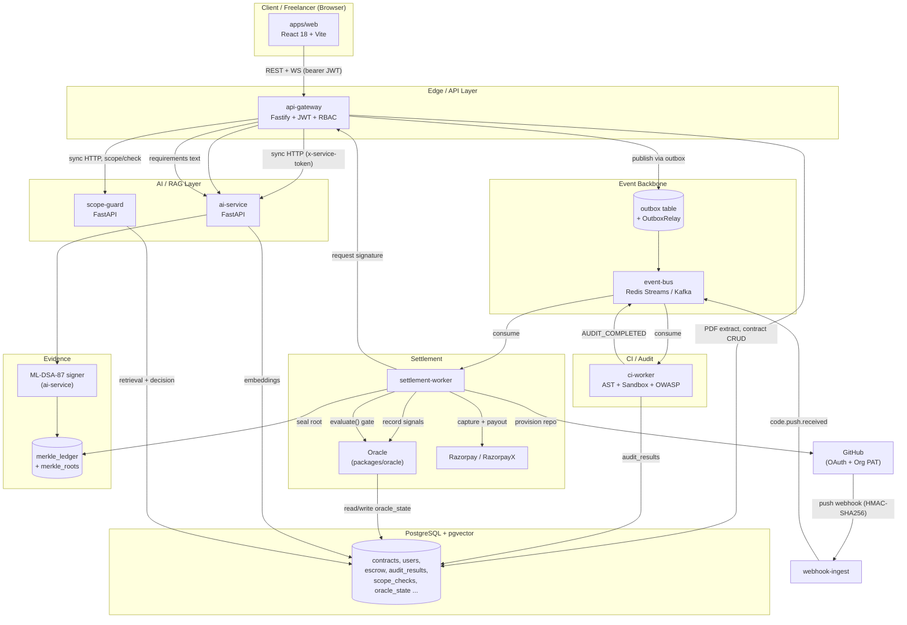
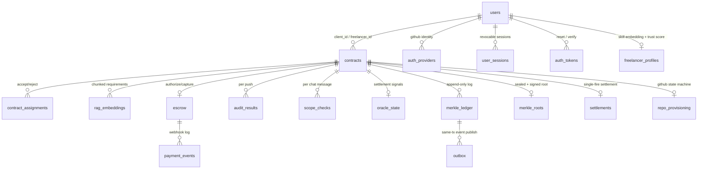

# AssureCode — Low-Level Architecture (LLA)

**Scope:** This document describes the system exactly as implemented in this repository, verified against source (file paths and, where feasible, line numbers are cited throughout). It intentionally corrects the "reference" business flow where the real implementation differs from it, and it calls out every stub, mock, synthetic-calibration, or not-fully-wired component rather than presenting an idealized picture. It does not describe planned work, old README claims, or superseded designs — several of those are mentioned explicitly, but only to contrast them with what replaced them.

**How to read this:** Section 0 is the one-page mental model. Section 1 is the component inventory. Section 2 traces one contract end-to-end. Section 3 is the deep reference — every module, ten angles each. Section 4 is the database. Section 5 is the "what would break under questioning" list — read it before a presentation Q&A.

---

## Table of Contents

0. [System Overview](#0-system-overview)
1. [Component Table](#1-component-table)
2. [End-to-End Flow](#2-end-to-end-flow)
3. [Module Deep-Dives](#3-module-deep-dives)
   - 3.1 [Identity & Access](#31-identity--access)
   - 3.2 [Contract Lifecycle](#32-contract-lifecycle)
   - 3.3 [AI / RAG Layer (ai-service)](#33-ai--rag-layer-ai-service)
   - 3.4 [Scope Guard](#34-scope-guard)
   - 3.5 [Event Backbone](#35-event-backbone)
   - 3.6 [CI Worker Pipeline](#36-ci-worker-pipeline)
   - 3.7 [Settlement & Money](#37-settlement--money)
   - 3.8 [Ledger & Evidence](#38-ledger--evidence)
   - 3.9 [Cross-Cutting Concerns](#39-cross-cutting-concerns)
4. [Database Architecture](#4-database-architecture)
5. [Honest Gaps / Stub Inventory](#5-honest-gaps--stub-inventory)

---

## 0. System Overview

AssureCode is a monorepo (npm workspaces: `apps/*`, `packages/*`) implementing an escrow-and-audit marketplace for freelance software contracts. A client posts a contract with requirements (optionally extracted from an uploaded PDF), a freelancer is matched and assigned, the two parties negotiate scope through a mediated chat channel, the freelancer delivers code through a GitHub repository AssureCode provisions, every push is automatically sandboxed, statically analyzed, security-scanned, and run against hidden tests, and the results feed a deterministic trust score and a settlement gate ("the Oracle") that decides whether escrowed payment via Razorpay is captured and paid out. Every state-changing action is appended to a per-contract, cryptographically chained and Merkle-tree-structured ledger, and the final root is signed with a post-quantum signature (ML-DSA-87 / FIPS 204) once a contract settles.

Two corrections worth stating up front, because they are the two claims most likely to be challenged in a presentation:

1. **The "AI trust score" is not a model.** `XAI_score` (`apps/ai-service/app/routes/xai.py`) is a fixed, published linear formula over four measured terms (test pass rate, code maintainability, security findings, scope adherence). An LLM is invoked exactly once in that endpoint, strictly *after* the number is final, to write 2–3 sentences of prose explaining it — the narrative can never feed back into the score, and if the LLM is unavailable the score is still returned with `narrative: null`. This is deliberate and documented in the module's own docstring, which also records that the *previous* version of this endpoint had a `chat_sentiment` term nobody produced (the gateway posted a hardcoded `0.95`) and defaulted every field so an empty request scored 92/100.
2. **ML-DSA-87 (post-quantum signing) is real, not a placeholder.** `packages/ledger-client/src/ml_dsa.py` uses `dilithium-py`'s `ML_DSA_87`, a pure-Python FIPS 204 implementation, with correctly sized keys (2592-byte public key, 4896-byte private key, 4627-byte signature). Its docstring documents, in detail, exactly what it replaced: a module called `quantum_lattice.py` that computed no lattice arithmetic at all and had a verifier that checked one field of a signature against the SHA3 hash of another field of the *same* signature — a forgery that worked against any public key, for any message, in one line. That module has been fully removed from the codebase.

---

## 1. Component Table

| Component | Technology / Location | Purpose | Why Used | Where Used | Status |
|---|---|---|---|---|---|
| **Frontend (live)** | React 18 + Vite 6 + Tailwind, `apps/web/src`, no router (manual `pathname` branching in `App.jsx`) | Client & freelancer web UI: auth, contract creation, dashboards, chat, verification/XAI views | Fast iteration SPA, single deployable static bundle served behind the gateway | All user-facing flows | **Production-ready** |
| **Frontend (dead)** | `AssureCode-FrontEnd/` — no `package.json`, not in npm workspace glob, `src/data/` holds only 4 mock-data JS files | Earlier UI prototype | Superseded by `apps/web` | Not built, not served, not referenced by any script | **Dead / not implemented** |
| **api-gateway** | Fastify + TypeScript, `apps/api-gateway/src` | Single REST/WS ingress: auth, contracts, escrow, chat, PDF, webhooks-relay, KYC | Central point for JWT/session auth, RBAC, rate limiting, and the transactional outbox | Every client request; also the only service exposed publicly | **Production-ready** |
| **webhook-ingest** | Fastify 5 + TypeScript, `apps/webhook-ingest/src` | Receives and verifies GitHub `push` webhooks, resolves contract, publishes `code.push.received` | Isolates untrusted inbound webhook traffic (raw-body HMAC verification) from the gateway's JSON pipeline | GitHub → this service only | **Production-ready** |
| **ci-worker** | Node/TypeScript, `apps/ci-worker/src` | Sandboxes and audits freelancer code: AST metrics, hidden tests, OWASP static scan | The automated "did the delivered code meet quality/security bar" gate that feeds the trust score | Triggered by `code.push.received`; also `/simulate-push` for demos | **Production-ready** (real GitHub source fetch is feature-flagged off by default) |
| **ai-service** | Python 3.11 + FastAPI, `apps/ai-service/app` | Embeddings, RAG ingest, NLP matchmaking, LLM-backed security scan (Layer 2), test generation, XAI trust score, ML-DSA-87 signing | Centralizes every ML/LLM-touching capability behind one hexagonal ("ports") service | Called synchronously over HTTP by gateway, ci-worker, scope-guard, settlement-worker (via gateway) | **Production-ready**, LLM provider is Cloudflare Workers AI only |
| **scope-guard** | Python 3.11 + FastAPI, `apps/scope-guard/app` | Per-message RAG scope mediation + cumulative drift detection, anchored to the contract's genesis ledger hash | Objective: prevent scope creep by comparing chat requests against the hashed original requirements | Called synchronously by `api-gateway`'s chat route on every message | `/scope/check` **production-ready**; `/scope/drift/{id}` **implemented but calibration is synthetic**, and has no confirmed caller |
| **settlement-worker** | Node/TypeScript, `apps/settlement-worker/src` | Long-running consumer: aggregates oracle signals, drives the settlement gate, captures escrow, triggers payout, provisions GitHub repos, seals/signs the Merkle root | The one place money moves and the one place GitHub org repos get created | Subscribes to `AUDIT_COMPLETED`, `XAI_SCORED`, `SCOPE_CHECKED`, `ESCROW_LOCKED`, `ASSIGNMENT_ACCEPTED/REJECTED`, `SETTLEMENT_REQUESTED` | **Production-ready** (payment leg gated by real vs. fake Razorpay adapter selection) |
| **PostgreSQL + pgvector** | `pgvector/pgvector:pg16` (Docker), 25 migrations `infra/migrations/postgres/V001`–`V025` | System of record for everything: users, contracts, ledger, escrow, embeddings | Single durable store; pgvector gives vector similarity search without a separate vector DB | Every backend service | **Production-ready** |
| **Redis Streams / Kafka (event-bus)** | `packages/event-bus`, `ioredis` / `kafkajs` | Async pub/sub between gateway, webhook-ingest, ci-worker, settlement-worker | Decouples the request/response gateway from long-running CI/settlement work; consumer groups give at-least-once delivery | Selected via `EVENT_BUS_TYPE` (redis default, kafka opt-in overlay, in-memory in tests) | **Production-ready** (Redis is the shipped default; Kafka overlay exists and matches in shape) |
| **Neo4j (optional graph backend)** | `neo4j:5.26-community` + APOC, `apps/ai-service/app/ports/graph_repo.py` | Alternative freelancer/skill graph + trust-score store with native vector index | Graph-native matchmaking (skill graph traversal) as a research/enhancement path | Opt-in via `GRAPH_BACKEND=neo4j`; Postgres (`PostgresGraphRepo`) is the default | **Implemented, feature-controlled** (off by default) |
| **GitHub (OAuth)** | `apps/api-gateway/src/routes/auth.ts` | Freelancer identity linking (`read:user user:email` scope only) | Lets a freelancer prove their GitHub identity without granting repo scopes | Login/link flow in the web UI | **Production-ready** |
| **GitHub (Org PAT)** | `apps/settlement-worker/src/github-provisioner-client.ts` | Creates the org repo, adds the freelancer as an outside collaborator, attaches the webhook | Repos are org-owned, not user-owned, so provisioning needs org-admin privilege the OAuth login scope doesn't have | Triggered off `CONTRACT_LOCKED` → `ASSIGNMENT_ACCEPTED` | **Production-ready** |
| **Razorpay (Orders/Payments)** | `packages/razorpay-adapter` | Escrow: create order (`payment_capture:0`), capture on settlement approval, refund, webhook verification | India-focused payment gateway with native authorize/capture escrow semantics | `contracts-escrow.ts` (fund/verify), `settlement-worker` (capture) | **Real integration**; auto-falls back to a signature-honest fake when `keyId` isn't `rzp_`-prefixed |
| **RazorpayX (Payouts)** | `packages/razorpay-adapter` | Pays the freelancer's linked payout account after settlement | Separate payout rail from Checkout; needed to move money *out* to a freelancer, not just collect it | `settlement-worker`'s `attemptPayout` | **Real integration**, same fake fallback rule |
| **Docker sandbox** | `apps/ci-worker/src/sandbox/docker-sandbox.ts` | Executes freelancer code + hidden tests in an isolated, network-disabled container | Untrusted code execution must not reach the network or the host | `ci-worker`'s audit pipeline, preferred runner when a Docker daemon is reachable | **Production-ready** |
| **Node-permission sandbox** | `apps/ci-worker/src/sandbox/node-permission-sandbox.ts` + `egress-guard.cjs` | Fallback sandbox using Node's `--permission` flag plus a hand-rolled network-egress patch | Lets the pipeline run somewhere Docker isn't available (e.g., certain CI hosts) without silently allowing egress | `ci-worker`, selected when no Docker daemon is reachable, or pinned via `SANDBOX_RUNNER=node` | **Production-ready** (requires Node ≥ 22.15) |
| `packages/shared` | TS | Cross-service DTOs, `EVENT_TOPICS`, zod schemas, `owasp-2025-rules.json` (shared static-scan ruleset), password/email validators | One source of truth for cross-service contracts | api-gateway, ci-worker, settlement-worker, webhook-ingest, event-bus, ledger-client | **Production-ready** |
| `packages/config` | TS | Env loading (zod), pino logger, DB config builder, `assertProductionSecrets` | Prevents booting in prod with placeholder secrets | api-gateway, ci-worker, settlement-worker, webhook-ingest | **Production-ready** |
| `packages/event-bus` | TS | `createEventBus` factory: `RedisStreamsBus`, `KafkaBus`, `InMemoryBus`; `OutboxRelay` | Transport abstraction + outbox relay in one package | api-gateway (relay), ci-worker, settlement-worker, webhook-ingest | **Production-ready** |
| `packages/ledger-client` | TS + one Python module | RFC 8785 canonical JSON, RFC 6962 Merkle tree, hash-chain append, ML-DSA-87 signing/verification | The tamper-evidence and proof layer | api-gateway, settlement-worker (TS side); ai-service (Python `ml_dsa.py`, imported via path hack) | **Production-ready** |
| `packages/oracle` | TS | `OracleStore`: durable settlement gate (`evaluate()`, `recordAudit`, `recordScore`) | Single, durable (not in-memory) definition of the money-releasing decision | settlement-worker (writes + decides), api-gateway (reads threshold constant only) | **Production-ready** |
| `packages/razorpay-adapter` | TS | Real Razorpay/RazorpayX REST clients + parity fakes | Hand-rolled REST rather than the official SDK (documented choice) | settlement-worker, api-gateway | **Production-ready / requires configuration** (falls back to fake without live keys) |
| `packages/kyc-adapter` | TS | `KycPort` — verification session + payout-account onboarding | Would gate freelancer payouts on identity verification | api-gateway `/api/kyc/*` | **Stub only** — `FakeKycAdapter` is the sole implementation |
| `packages/email-adapter` | TS | `EmailPort` — verification and password-reset emails | Transactional email for the auth flows | api-gateway auth routes | **Stub only** — `FakeEmailAdapter` is the sole implementation, captures sends in-memory |
| `packages/telemetry` | TS | OpenTelemetry tracing, correlation IDs, Prometheus metrics registry, `startMetricsServer` | Cross-service observability | api-gateway, ci-worker, webhook-ingest, event-bus, ledger-client (settlement-worker transitively) | **Production-ready** |

---

## 2. End-to-End Flow

This traces one contract from registration to signed settlement, correcting the reference flow wherever the implementation differs from it (each correction called out inline).

### 2.1 Registration / Login
`POST /auth/register` (`apps/api-gateway/src/routes/auth.ts`) hashes the password with **argon2id** (`@node-rs/argon2`), validates it with `@assurecode/shared`'s `validateNewPassword` (8–128 chars, no whitespace, printable ASCII, ~180-entry common-password blocklist — enforced only when *setting* a password, not at login, so legacy demo accounts keep working), and inserts into `users`. Login issues a JWT (`@fastify/jwt`) and creates a row in `user_sessions`; every subsequent request is checked against `isSessionActive()` so a stateless JWT is still revocable server-side. MFA (`mfa_credentials`) and GitHub OAuth login (`auth_providers`, AES-encrypted access token via `pgp_sym_encrypt`) are alternate/additional auth paths into the same session model.

### 2.2 Contract Creation + Requirements
The client fills in title/description/requirements/budget/deadline in `ContractInitialization.jsx`. **Correction to the reference flow:** PDF text extraction happens in **api-gateway**, not ai-service — `POST /api/pdf/extract` (`apps/api-gateway/src/middleware/pdf.ts`) runs `pdf-parse`, capped at 10 MB / 50 pages / 200,000 extracted characters. The extracted text is shown to the client, who must explicitly click "Use Extracted Text" to copy it into the requirements field; the raw PDF text is stored separately in `contracts.pdf_raw_text` and is **not** automatically part of the hashed baseline unless the client copies it over. `POST /api/contracts/initialize` writes the `contracts` row (`status = DRAFT`) and appends a `CONTRACT_INITIALIZED` ledger entry — this is the contract's genesis (H0) that scope-guard anchors every later decision to.

### 2.3 RAG Ingest + Matchmaking
The gateway calls ai-service's `POST /rag/ingest` to chunk (one chunk per semantic unit — paragraph/list-item/sentence, not greedy packing) and embed (`all-MiniLM-L6-v2`, 384-dim) the requirements text into `rag_embeddings` (pgvector). `POST /api/contracts/:id/match` calls ai-service's `/match`, a retrieve-then-rerank matchmaker: top-50 candidates by pgvector cosine similarity against `freelancer_profiles.profile_embedding`, then reranked by `0.5·skill_cosine + 0.35·trust_score + 0.15·normalized_deliveries`.

### 2.4 Assignment + Accept/Reject
The client picks a freelancer; `contract_assignments` gets a `PENDING` row (partial unique index enforces at most one pending assignment per contract). The freelancer accepts or rejects (`ASSIGNMENT_ACCEPTED` / `ASSIGNMENT_REJECTED` events). Rejection resets the contract to be re-matched; acceptance triggers escrow funding and repo provisioning in parallel.

### 2.5 Escrow Funding
`contracts-escrow.ts` creates a Razorpay **Order** with `payment_capture: 0` — i.e., authorize now, capture later — via `packages/razorpay-adapter`. The client completes Razorpay Checkout; a webhook or client-side verification call (`verifyCheckoutSignature`, HMAC-SHA256 over `orderId|paymentId`) flips `escrow.status` to `AUTHORIZED`. **Correction:** this is not a generic "payment" step — capture is deliberately withheld until the Oracle approves settlement (§2.10).

### 2.6 Contract Lock + GitHub Provisioning
The client locks the contract (`status = LOCKED`); a `LOCKED` ledger entry is appended via `append_ledger_and_outbox`, publishing `contract.locked` through the transactional outbox. **Correction to the reference flow:** GitHub repo provisioning is **not** triggered directly by the gateway — the gateway "stays a thin request/response surface" by design. `settlement-worker` listens for `ASSIGNMENT_ACCEPTED` (which implies the contract is already `LOCKED`) and runs `github-provisioner-client.ts`: `createOrgRepo` → `addOutsideCollaborator` (the freelancer, by their linked GitHub login) → `attachWebhook`, tracked through a `repo_provisioning` state machine (`PENDING → REPO_CREATED → COLLABORATOR_ADDED → WEBHOOK_ATTACHED → COMPLETE`). Each of the three GitHub calls is individually idempotent, and `reconcileStuckProvisioning` retries stuck rows (capped at 5 attempts, then `FAILED` for manual review).

### 2.7 Development + Push
The freelancer develops against the provisioned repo and pushes. **What "contract chat" actually is:** `contracts-chat.ts` (`POST /api/contracts/:contractId/chat`) is human-to-human messaging, not an LLM assistant — every message is synchronously checked against scope-guard's `/scope/check` (5-second timeout, **fail-closed**: an unreachable or erroring guard blocks the message rather than delivering it) before being relayed over a WebSocket (`GET /api/contracts/:contractId/chat/stream`) to the other party.

### 2.8 Webhook → CI Pipeline
GitHub POSTs the push event to `webhook-ingest`'s `/webhooks/github`. `verifyGitHubSignature()` recomputes `HMAC-SHA256(GITHUB_WEBHOOK_SECRET, rawBody)` and compares it against the `x-hub-signature-256` header with `crypto.timingSafeEqual`. On success, `resolveContractId()` maps `contracts.github_repo_full_name` to a contract (preferring `LOCKED`/`IN_PROGRESS`) and publishes `code.push.received` on the event bus. `ci-worker` consumes it and runs: Docker (or Node-permission) sandbox → Babel-based AST analysis (McCabe complexity, Halstead volume, SEI maintainability index) → hidden Jest test execution → dual-layer OWASP static scan (ci-worker's own TS layer, plus an optional call to ai-service's `/security-scan` for the LLM semantic layer). Results are written to `audit_results` **before** `AUDIT_COMPLETED` is published, so the stored row and the event can never disagree.

### 2.9 Trust Scoring
Telemetry from the audit (`passed_tests/total_tests`, `maintainability`, vulnerability counts) is sent to ai-service's `POST /xai/score`, which computes the deterministic linear score described in §0 and persists it to the freelancer's graph node (Postgres by default, Neo4j if `GRAPH_BACKEND=neo4j`), publishing `XAI_SCORED`.

### 2.10 The Oracle Gate
`settlement-worker` records the three CI booleans (`recordAudit`) and the trust score (`recordScore`, with a monotonic write guard so an out-of-order event under Kafka can't drag the score backwards) into `oracle_state`. On `SETTLEMENT_REQUESTED`, `OracleStore.evaluate()` (`packages/oracle`) reads that state plus a **live** aggregation of `scope_checks` (not a stored copy) and applies the gate: `astPassed && testsPassed && securityPassed && scopePassed(rejected==0) && trustScore>=85 && criticalVulns===0`. A missing row is not a permissive default — every signal starts false/null and blocks.

### 2.11 Capture, Payout, Ledger Seal, Signature
On approval: `claimSettlement` (single-fire guard via `settlements` PK + conditional `ON CONFLICT`) → `payments.capturePayment()` on the `AUTHORIZED` escrow row (selected by status, never trusted from an event payload) → `commitSettlement` (one transaction: `SETTLEMENT_COMPLETED` ledger entry, `escrow.RELEASED`, `settlements.COMPLETED`, freelancer `trust_score` written 0–1 scale) → `attemptPayout` (RazorpayX, deliberately outside the DB transaction, deterministic idempotency key `payout_${contractId}`) → `sealAndSignMerkleRoot` (`computeAndStoreRoot` builds the RFC 6962 tree over the contract's ledger leaves; `requestRootSignature` calls the gateway, which calls ai-service's `/ledger/sign-root`, which signs with ML-DSA-87 and returns the signature for storage in `merkle_roots`). A signing failure is logged loudly but never unwinds the settlement — the money has already moved, and an unsigned root is a re-drivable, idempotent weaker claim, not a broken settlement.

### 2.12 Crash Recovery
Four reconciliation loops run at startup and on fixed intervals: `reconcileAbandonedSettlements` (recovers rows stuck `PROCESSING` after a crash, re-evaluates the Oracle before completing), `reconcilePendingPayouts` (every 5 min, cap 5 attempts → `FAILED_TERMINAL`), `reconcileMissingScores` (every 2 min, cap 5), `reconcileStuckProvisioning` (every 3 min, cap 5). All follow the same "retry-capped-then-terminal" shape so a stuck contract surfaces for manual review instead of retrying forever or silently dropping.

---

## 3. Module Deep-Dives

Each module below is broken into the same ten angles: **Purpose, Why, Where, Input, Processing, Output, Dependencies, Security, Next Step, Code refs, Status.**

### 3.1 Identity & Access

#### 3.1.1 Authentication (password + JWT + session revocation)

- **Purpose:** Prove and maintain a user's identity across requests.
- **Why:** A stateless JWT alone can't be revoked; AssureCode needs logout / forced-session-kill (e.g., on password reset) to actually take effect immediately, not just at token expiry.
- **Where:** `apps/api-gateway/src/middleware/auth.ts`, `apps/api-gateway/src/routes/auth.ts`, `apps/api-gateway/src/middleware/session-store.ts`.
- **Input:** `email`/`password` on login; bearer JWT (header, or `?token=` query param for WebSocket routes that can't set headers) on every subsequent request.
- **Processing:** Registration hashes the password with **argon2id** (`@node-rs/argon2`) and validates it against `validateNewPassword` (`packages/shared`). Login verifies the hash, issues a JWT via `@fastify/jwt`, and inserts a row into `user_sessions`. Every authenticated request runs `verify_service_token`-equivalent JWT verification **and then** `isSessionActive()`, a DB lookup confirming the session hasn't been revoked (`user_sessions.revoked_at IS NULL`).
- **Output:** Signed JWT to the client; a live `user_sessions` row; on every subsequent request, an `AuthUser` object attached to `request.user`.
- **Dependencies:** `@fastify/jwt`, `@node-rs/argon2`, PostgreSQL (`users`, `user_sessions`).
- **Security:** argon2id (memory-hard, GPU-resistant) beats bcrypt/PBKDF2 for password storage; session revocation closes the "stolen JWT still works until it expires" gap that pure-JWT auth has; `PUBLIC_PATHS`/`PUBLIC_PREFIXES` allow-list keeps auth mandatory-by-default for new routes.
- **Next step:** RBAC middleware (§3.1.2) runs after identity is established, on the same request.
- **Code refs:** `apps/api-gateway/src/middleware/auth.ts:170-178` (hash/verify), session check via `middleware/session-store.ts`.
- **Status:** Fully implemented, production-ready.

#### 3.1.2 RBAC / Authorization

- **Purpose:** Restrict actions to the right role and the right party on a specific contract.
- **Why:** A client should not be able to act on another client's contract; a freelancer shouldn't self-assign; only verified freelancers should be payable. This is enforced server-side because the frontend's role-based UI hiding is not a security boundary.
- **Where:** `apps/api-gateway/src/middleware/rbac.ts`, composed guard bundles in `apps/api-gateway/src/context.ts:313-348` (`clientOnly`, `clientVerified`, `settlementGuards`, `freelancerOnly`, `contractPartyOnly`, `freelancerContractParty`).
- **Input:** `request.user` (from §3.1.1) plus route params (e.g., `:contractId`).
- **Processing:** `requireRole(role)` checks `user.role`; `requireKycVerified` checks the DB-sourced `kyc_status` (not a JWT claim, so a KYC status change takes effect immediately without re-login); `requireContractParty` loads the contract and confirms the caller is its client or assigned freelancer before allowing chat, escrow, or audit actions on it.
- **Output:** 403 on failure; otherwise the request proceeds to the route handler.
- **Dependencies:** PostgreSQL (`contracts`, `users`).
- **Security:** These three guards were **originally exported but never attached to any route** — dead code — until a security-review pass wired them into `registerAuth`'s hook and the `context.ts` guard bundles; the `requireContractParty` comment explicitly documents the vulnerability it closed (any client could act on any contract by ID). This history is worth stating in a presentation as evidence of iterative hardening, not a current gap.
- **Next step:** The route handler itself (contracts, escrow, chat, audit routes).
- **Code refs:** `apps/api-gateway/src/middleware/rbac.ts`; `apps/api-gateway/src/context.ts:313-348`.
- **Status:** Fully implemented, production-ready.

#### 3.1.3 GitHub OAuth Login (identity linking)

- **Purpose:** Let a freelancer prove ownership of a specific GitHub account.
- **Why:** The org-repo-provisioning flow (§3.2.4) needs to know *which* GitHub login to add as an outside collaborator; OAuth is how the freelancer asserts that identity, scoped minimally.
- **Where:** `apps/api-gateway/src/routes/auth.ts` (OAuth redirect/callback), `apps/web/src/GithubCallback.jsx`, `apps/web/src/ConnectReturn.jsx`.
- **Input:** GitHub OAuth authorization code (scope `read:user user:email` only — **no repo scope**, deliberately, since repos are org-owned and provisioned via a separate org PAT, not the user's own token).
- **Processing:** Exchanges the code for an access token, stores it AES-encrypted (`pgp_sym_encrypt`) in `auth_providers.access_token_encrypted`, records `github_login`, `token_scopes`, `connected_at`.
- **Output:** `auth_providers` row linking `user_id` ↔ GitHub identity; the frontend redirects to `ConnectReturn.jsx`.
- **Dependencies:** GitHub OAuth API, PostgreSQL `pgcrypto` extension.
- **Security:** Token encrypted at rest; minimal scope means a compromised token can't read/write the freelancer's own repos, only identify them.
- **Next step:** `github-provisioner-client.ts` (§3.2.4) reads `github_login` from this table when adding the freelancer as a collaborator — it does **not** reuse this OAuth token, since provisioning needs org-admin privilege the freelancer's own token doesn't have.
- **Code refs:** `apps/api-gateway/src/routes/auth.ts`; migration `V017__github_oauth.sql`.
- **Status:** Fully implemented, production-ready.

#### 3.1.4 Email Verification & Password Reset

- **Purpose:** Confirm email ownership at registration; allow secure self-service password recovery.
- **Why:** Standard account-security hygiene; also the most recently touched auth surface (commit `591f4e3`).
- **Where:** `apps/api-gateway/src/routes/auth.ts` (`POST /auth/forgot-password`, `/auth/reset-password`, `/auth/verify-email`), `apps/web/src/ForgotPasswordScreen.jsx`, `ResetPasswordScreen.jsx`, `VerifyEmailScreen.jsx`.
- **Input:** Email address (forgot-password); reset token + new password (reset-password); verification token (verify-email).
- **Processing:** A token is generated, **only its SHA-256 hash** is stored in `auth_tokens.token_hash` (so a DB leak doesn't hand out usable tokens), with `type` (`EMAIL_VERIFICATION`/`PASSWORD_RESET`), `expires_at`, and `used_at`. `forgot-password` always returns a generic response regardless of whether the account exists (prevents account enumeration) and is rate-limited. A successful reset revokes **all** existing sessions for that user (closes any session an attacker may have had).
- **Output:** An email is sent via `@assurecode/email-adapter` — see the Security note below.
- **Dependencies:** PostgreSQL (`auth_tokens`, `users.email_verified_at`/`password_changed_at`), `@assurecode/email-adapter`.
- **Security:** Token hashing, generic responses, rate limiting, and full session revocation on reset are all real, defensive measures. **However:** the only implementation of `EmailPort` is `FakeEmailAdapter`, which captures sent messages in an in-memory array and deliberately never logs the raw token/URL (security-sensitive) — meaning **no real email is ever sent** in the current deployment. This is a genuine functional gap, not just cosmetic: a user cannot actually complete verification or reset via email today without a real provider (SES/Postmark/SMTP) being wired in.
- **Next step:** N/A (terminal auth flow).
- **Code refs:** migration `V025__password_reset_and_verification.sql`; `apps/api-gateway/src/context.ts:70-74` (adapter wiring comment).
- **Status:** **Implemented but feature-gapped** — token/session logic is production-ready; email delivery is stub-only.

#### 3.1.5 KYC Adapter

- **Purpose:** Verify freelancer identity and onboard a payout account before money can flow to them.
- **Why:** Regulatory/compliance posture for a payments platform, and a prerequisite the RBAC `requireKycVerified` guard is designed to enforce.
- **Where:** `packages/kyc-adapter`, consumed by `apps/api-gateway`'s `/api/kyc/*` routes.
- **Input:** Freelancer identity documents / payout account details (in the real-provider case).
- **Processing:** `KycPort` interface: `createVerificationSession`, `getVerificationStatus`, `createPayoutAccount`, `createPayoutOnboardingLink`.
- **Output:** `kyc_status` on `users`/`kyc_verifications`.
- **Dependencies:** Would depend on a real KYC provider (Digio/HyperVerge/Signzy are named as candidates in code comments); currently none.
- **Security:** The only implementation, `FakeKycAdapter`, is explicitly documented as replacing an earlier, worse behavior: the gateway's `/api/kyc/verify` route used to write `kyc_status='VERIFIED'` **unconditionally**, with no provider consulted at all. The fake at least makes the gap explicit and consistent rather than silently lying.
- **Next step:** `requireKycVerified` (§3.1.2) gates on whatever this adapter reports.
- **Code refs:** `packages/kyc-adapter/src/index.ts`.
- **Status:** **Stub only** — no real KYC provider wired.

### 3.2 Contract Lifecycle

#### 3.2.1 Contract Initialization & PDF Ingestion

- **Purpose:** Capture the client's requirements as the single source of truth the rest of the system (matchmaking, RAG scope-checking, XAI scope adherence) anchors against.
- **Why:** Requirements need to exist as text (for embedding) and as an immutable, hashed baseline (for scope enforcement) — a PDF alone is neither.
- **Where:** `apps/web/src/components/ContractInitialization.jsx`; `apps/api-gateway/src/routes/pdf.ts`, `middleware/pdf.ts`; `apps/api-gateway/src/routes/contracts-lifecycle.ts`.
- **Input:** Title, description, requirements text, budget, deadline; optional PDF upload (multipart, capped at 10 MB by `@fastify/multipart`).
- **Processing:** If a PDF is uploaded, `POST /api/pdf/extract` runs `pdf-parse`'s `PDFParse`, hard-capped at 50 pages / 200,000 extracted characters. The extracted text is shown to the client for review — it is **not** auto-merged into `requirements`; the client must click "Use Extracted Text." `POST /api/contracts/initialize` inserts into `contracts` (`status=DRAFT`) and appends the `CONTRACT_INITIALIZED` ledger entry via `append_ledger_and_outbox` (this is the contract's H0/genesis).
- **Output:** `contracts` row (`requirements`, `pdf_raw_text` stored separately), first `merkle_ledger` row for this contract, an outbox-relayed `contract.initialized` event (documented as intentionally publish-only — no current consumer).
- **Dependencies:** `pdf-parse` npm package, PostgreSQL, `packages/ledger-client`.
- **Security:** Size/page/char caps prevent a PDF-based resource-exhaustion attack; the requirement-text-vs-raw-PDF separation means a client can't claim scope enforcement covers text they never explicitly approved.
- **Next step:** RAG ingest (§3.3.2) embeds the finalized `requirements` text.
- **Code refs:** `ContractInitialization.jsx:447-467` (upload/extract handlers), `apps/api-gateway/src/middleware/pdf.ts` (`MAX_PDF_BYTES`, `MAX_PDF_PAGES`, `MAX_EXTRACTED_CHARS`).
- **Status:** Fully implemented, production-ready.

#### 3.2.2 Contract Status State Machine

- **Purpose:** Give every contract an authoritative lifecycle state.
- **Why:** Almost every downstream decision (webhook contract resolution, settlement eligibility, UI dashboards) branches on contract status.
- **Where:** `contracts.status` column, CHECK-constrained; widened across migrations.
- **Input:** State transition requests from lifecycle routes (`initialize`, `match`, `assign`, `lock`, escrow events).
- **Processing:** States observed across migrations: `DRAFT → LOCKED → IN_PROGRESS → COMPLETED`, plus `DISPUTED`, and `ACTIVE` (added `V022`). Transitions are enforced by the CHECK constraint at the DB layer and by route-level logic in `contracts-lifecycle.ts`/`contracts-escrow.ts`.
- **Output:** Current status drives: which routes are callable (`contractPartyOnly` etc.), which contract `webhook-ingest`'s `resolveContractId()` prefers (LOCKED/IN_PROGRESS first), and dashboard filtering (`GET /api/contracts/owned`, `/mine`).
- **Dependencies:** PostgreSQL CHECK constraint.
- **Security:** DB-level CHECK constraint means an application bug can't silently write an invalid status.
- **Next step:** Feeds every other module that reads contract state.
- **Code refs:** `infra/migrations/postgres/V001__init.sql` (initial states), `V022__repo_provisioning.sql` (adds `ACTIVE`).
- **Status:** Fully implemented, production-ready.

#### 3.2.3 Assignment Accept/Reject

- **Purpose:** Let a matched freelancer explicitly agree to (or decline) a contract before work/escrow/repo provisioning proceeds.
- **Why:** Prevents a client from unilaterally "assigning" a freelancer who never agreed, and gives a clean re-match path on rejection.
- **Where:** `contract_assignments` table (`V024__assignment_decision.sql`); `apps/web/src/components/FreelancerAssignments.jsx`.
- **Input:** Freelancer's accept/reject decision on a `PENDING` assignment.
- **Processing:** A partial unique index enforces **at most one `PENDING` assignment per contract** at a time, so a client can't double-assign while one decision is outstanding. Accept publishes `ASSIGNMENT_ACCEPTED` (which fans out to escrow-funding and GitHub provisioning); reject publishes `ASSIGNMENT_REJECTED` (contract becomes re-matchable) and creates a `notifications` row for the client.
- **Output:** `contract_assignments.status ∈ {PENDING, ACCEPTED, REJECTED}`; downstream events.
- **Dependencies:** PostgreSQL, event-bus.
- **Security:** The unique-pending constraint is a DB-level race-condition guard, not just an application check.
- **Next step:** Acceptance triggers §3.2.4 (repo provisioning) and escrow funding (§3.7.2) in parallel.
- **Code refs:** `V024__assignment_decision.sql`.
- **Status:** Fully implemented, production-ready.

#### 3.2.4 GitHub Repo Provisioning & Outside Collaborator

- **Purpose:** Automatically create the org-owned repository the freelancer will push code to, grant them access, and attach the webhook that feeds the CI pipeline — with no manual admin step.
- **Why:** Repos must be org-owned (so AssureCode retains control/audit visibility and can revoke access on dispute) rather than freelancer-owned; this requires org-admin privilege that the freelancer's own OAuth token doesn't carry.
- **Where:** `apps/settlement-worker/src/github-provisioner-client.ts`, driven from `apps/settlement-worker/src/worker.ts`.
- **Input:** `ASSIGNMENT_ACCEPTED` event (contract already `LOCKED`); GitHub org PAT (`GITHUB_TOKEN`) + org name (`GITHUB_ORG`) from environment; freelancer's `github_login` (from `auth_providers`, §3.1.3).
- **Processing:** Three sequential, individually idempotent GitHub REST calls: `createOrgRepo` → `addOutsideCollaborator` → `attachWebhook` (pointing at `webhook-ingest`). Progress is tracked in `repo_provisioning` (`PENDING → REPO_CREATED → COLLABORATOR_ADDED → WEBHOOK_ATTACHED → COMPLETE | FAILED`), with a unique constraint on `repo_name` (`V023`) and a foreign key to the freelancer (`V022`).
- **Output:** A real GitHub repository under the org, the freelancer added as an outside collaborator, a webhook attached; `contracts.github_repo_full_name` set.
- **Dependencies:** GitHub REST API (raw `fetch`, not Octokit), PostgreSQL.
- **Security:** The org PAT is a service credential, never exposed to the frontend; scoped to org-repo-admin operations only, held server-side in settlement-worker.
- **Next step:** Freelancer pushes code → `webhook-ingest` (§3.5.1).
- **Code refs:** `worker.ts` (event handler wiring), `github-provisioner-client.ts` (`createOrgRepo`/`addOutsideCollaborator`/`attachWebhook`), `V022__repo_provisioning.sql`, `V023__repo_name_unique.sql`.
- **Status:** Fully implemented, production-ready; recovered from failure by `reconcileStuckProvisioning` (cap 5 attempts → `FAILED`).

### 3.3 AI / RAG Layer (ai-service)

All of `apps/ai-service` sits behind a single FastAPI app (`app/main.py`) with `dependencies=[Depends(verify_service_token)]` set on the constructor — every route requires an `x-service-token` header except a small allow-list (`/healthz`, `/readyz`, `/metrics`, `/`, `/docs`). `assert_configured()` runs at **import time**, so a missing token config crashes the process before it binds a port rather than serving unauthenticated. `/readyz` forces the embedder to actually load (not just construct) so a cold-start request doesn't eat the model-load latency.

#### 3.3.1 Embedding Generation

- **Purpose:** Turn text (contract requirements, chat messages, freelancer profiles) into vectors for similarity search.
- **Why:** Every retrieval-based decision in the system (RAG scope-checking, matchmaking) needs a numeric similarity measure.
- **Where:** `apps/ai-service/app/ports/embedder.py`; `POST /embed`, `/embed/batch` (`app/routes/embed.py`).
- **Input:** Raw text string(s).
- **Processing:** `sentence-transformers`, model `all-MiniLM-L6-v2`, output L2-normalized to 384 dimensions. Lazily loaded (`_ensure_loaded`) so importing the module doesn't pull in `torch` when `EMBED_PROVIDER=fake`. `FakeEmbedder` is a deterministic SHA-256-bucket hash embedder used for tests/offline runs.
- **Output:** 384-dim float vector(s).
- **Dependencies:** `sentence-transformers`, `torch`.
- **Security:** N/A (no untrusted-input execution risk beyond normal text parsing).
- **Next step:** Written to `rag_embeddings`/`freelancer_profiles.profile_embedding` (pgvector), or used directly for a one-off similarity comparison (scope-guard).
- **Code refs:** `app/ports/embedder.py:35-104`; default model in `app/settings.py:69-71`.
- **Status:** Fully implemented, production-ready.

#### 3.3.2 RAG Ingest & Retrieval

- **Purpose:** Make the contract's requirements text searchable by semantic similarity, chunk by chunk.
- **Why:** Scope-guard needs to compare an incoming chat message against the *closest matching* piece of the contract, not the whole document as one blob.
- **Where:** `app/routes/rag.py` (`POST /rag/ingest`, `GET /rag/count/{contract_id}`); `app/services/chunker.py`; `app/ports/rag_store.py`.
- **Input:** Contract's finalized requirements text (from api-gateway, after contract initialization).
- **Processing:** `chunker.py` splits into one chunk per semantic unit (paragraph/list-item/sentence) — documented as a deliberate choice after a benchmark showed greedy packing collapsed in-scope recall from 4/5 to 1/5. Each chunk is embedded (§3.3.1) and written to `rag_embeddings` (pgvector) via `PostgresRagStore`. Retrieval (`store.search`) filters `WHERE contract_id = %s` then ranks by cosine (`<=>` operator) — Postgres prefers the per-contract btree index over the global HNSW index here, so retrieval is **exact** cosine ranking, not approximate, despite the HNSW index existing on the column.
- **Output:** Top-k `(chunk_idx, content, similarity)` tuples for a query vector.
- **Dependencies:** PostgreSQL + pgvector, `sentence-transformers`.
- **Security:** `PostgresRagStore` **raises `RagStoreUnavailable`** on a DB failure rather than silently falling back to an in-memory store (an earlier version did the latter) — so a scope decision is never made against a corpus that silently failed to load.
- **Next step:** Consumed by scope-guard's `/scope/check` (§3.4.1); not used by any chat/Q&A feature (none exists).
- **Code refs:** `app/services/chunker.py:10-32`; `app/ports/rag_store.py:8-17, 150-258`.
- **Status:** Fully implemented, production-ready.

#### 3.3.3 NLP Matchmaking

- **Purpose:** Rank candidate freelancers against a contract's requirements.
- **Why:** Manual freelancer discovery doesn't scale; a hybrid retrieve-then-rerank approach balances skill fit against track record.
- **Where:** `app/services/matchmaker.py`; `POST /match` (`app/routes/match.py`).
- **Input:** Contract requirements text; the pool of `freelancer_profiles` (each with a `profile_embedding vector(384)`).
- **Processing:** Retrieve top-50 candidates by pgvector cosine similarity (HNSW-indexed), then rerank by `score = 0.5·skill_cosine + 0.35·trust_score + 0.15·normalized_deliveries` (default weights, configurable via settings).
- **Output:** Ranked list of candidate freelancers with scores.
- **Dependencies:** PostgreSQL + pgvector (or Neo4j, if `GRAPH_BACKEND=neo4j` — see §3.9.4), `GraphRepo` port.
- **Security:** N/A.
- **Next step:** Presented to the client in `ContractInitialization.jsx` for manual selection; feeds into §3.2.3 on acceptance.
- **Code refs:** `app/services/matchmaker.py`.
- **Status:** Fully implemented, production-ready (Postgres backend default; Neo4j opt-in).

#### 3.3.4 LLM Client

- **Purpose:** Single abstraction point for every LLM call in the system.
- **Why:** Centralizing provider choice, retries, and determinism settings in one port avoids each caller reinventing error handling.
- **Where:** `app/ports/llm_client.py`; consumed by exactly three callers: security-scan Layer 2 (§3.3.5), test generation (§3.3.7), and the XAI narrative (§3.3.6).
- **Input:** A prompt string, `max_tokens`.
- **Processing:** `CloudflareWorkersAiClient` calls `@cf/meta/llama-3.1-8b-instruct` (default model) at Cloudflare's REST endpoint with **`temperature: 0`**, set explicitly for determinism — the docstring records a real repro where an unset temperature produced 0–11 vulnerability findings across identical runs of the same code. Retries (max 3, exponential backoff capped at 8s) only on 429/5xx/network errors, honoring `Retry-After`; any other 4xx (e.g. revoked key) fails immediately rather than silently falling back to fake data (a past bug did exactly that). `FakeLlmClient` is the deterministic offline/test double — it string-matches two load-bearing phrases from the security-scan prompt template to distinguish a security-scan call from a test-gen call, returning `"[]"` vs. a hardcoded Jest fixture respectively.
- **Output:** Generated text (or raises `LlmUnavailableError`).
- **Dependencies:** Cloudflare Workers AI REST API.
- **Security:** No secrets in prompts by construction of the callers; §3.3.5 additionally sanitizes *untrusted* code before it reaches this client (prompt-injection defense).
- **Next step:** Varies by caller — see §3.3.5–3.3.7.
- **Code refs:** `app/ports/llm_client.py:9-19` (provider history), `:161-292` (Cloudflare client), `:134-159` (fake client); `app/deps.py:99-118` (provider selection — only `cloudflare` or `fake` are valid, anything else raises `ValueError`).
- **Status:** Fully implemented, production-ready. **Explicitly not Claude/Anthropic, not OpenAI, not Gemini** — those adapters existed historically and were deliberately removed; this is worth stating plainly in a presentation to avoid an inaccurate claim.

#### 3.3.5 Security Scanner (dual-layer OWASP Top 10:2025)

- **Purpose:** Statically and semantically audit freelancer-submitted code for known vulnerability classes.
- **Why:** Security posture is one of the four inputs to the trust score and one of the four gates the Oracle checks before releasing payment.
- **Where:** `app/routes/security_scan.py`; `app/services/owasp_static.py`; `app/services/prompt_guard.py`; a TypeScript counterpart in `apps/ci-worker/src/security-auditor.ts`.
- **Input:** `SecurityScanRequest{code, contract_id, include_static, include_llm}`, code capped at 200,000 characters.
- **Processing:** Two independent layers, **never merged into an undifferentiated score** (each finding carries `layer: "static"|"llm"`):
  - **Layer 1 (static):** Hand-authored regex rules loaded from `packages/shared/src/owasp-2025-rules.json` — the exact same JSON file `ci-worker`'s TypeScript auditor compiles, so the two languages share one rule set. Each rule is compiled twice (per-line and whole-source with `re.DOTALL`) to catch single- and multi-line patterns. Taxonomy: OWASP Top 10:2025 (A01–A10), 22+ concrete rule types including `SQL_INJECTION`, `COMMAND_INJECTION`, `HARDCODED_SECRET`, `PATH_TRAVERSAL`, `DYNAMIC_CODE_EXECUTION`, `INSECURE_DESERIALIZATION`, `JWT_VERIFICATION_SKIPPED`, `WEAK_HASH_ALGORITHM`, `SSRF_UNVALIDATED_FETCH`, `WILDCARD_CORS`, `TLS_VERIFICATION_DISABLED`, `AUTH_FAILS_OPEN`. `ci-worker` calls this endpoint with `include_static=False` to avoid running the static pass twice.
  - **Layer 2 (LLM):** The code is sent through `prompt_guard.py`'s nonce-delimited fencing (a random 16-hex-char delimiter wraps the untrusted code, backtick runs are neutralized) before being embedded in `PROMPT_TEMPLATE` and sent to the LLM client, asking for a strict JSON array of findings with explicit anti-false-positive rules (must name the exact taint-source/sink lines, must be exploitable as shown). `_extract_json_array`/`_normalize_llm_findings` parse and validate the response, dropping unknown categories/severities/out-of-range line numbers.
  - **Prompt-injection defense:** `prompt_guard.py` also *detects* injection attempts within the submitted code (patterns: `INSTRUCTION_OVERRIDE`, `ROLE_INJECTION`, `FINDING_SUPPRESSION`, `SAFETY_ASSERTION`, `PROMPT_EXFILTRATION`, `DELIMITER_BREAKOUT`) and reports a detected attempt as its **own HIGH-severity finding** (`A05:2025`, `LLM_PROMPT_INJECTION_ATTEMPT`) rather than silently stripping it — an attempt to manipulate the auditor is itself treated as a vulnerability.
- **Output:** `SecurityScanResponse{vulnerabilities[], passed, score, layers_run[]}`. Scoring: `compute_security_score = max(0, 100 − 40·critical − 20·high − 5·total)` — this **double-counts** critical/high findings (once at tier weight, again in the flat `5·total` term) **deliberately**, reproduced rather than fixed, because the Python and TypeScript implementations must agree byte-for-byte. `passed = (critical==0 and high==0)`.
- **Dependencies:** `packages/shared/src/owasp-2025-rules.json`, the LLM client (§3.3.4).
- **Security:** This module *is* a security control; its own hardening (prompt-injection detection) is notable and worth highlighting.
- **Next step:** Findings feed `audit_results` (via ci-worker), the Oracle's `securityPassed` signal, and the XAI security term.
- **Code refs:** `app/services/owasp_static.py:20-131`; `app/services/prompt_guard.py:238-260`; `app/routes/security_scan.py:34-86, 194-196`.
- **Status:** Fully implemented, production-ready. No dedicated `XSS_*` rule type was found among the sampled static rules — worth verifying against the full JSON file if XSS coverage specifically is claimed in a presentation.

#### 3.3.6 XAI Trust Score

- **Purpose:** Produce a single, deterministic, interpretable 0–100 number summarizing a delivery's quality, from measured CI telemetry.
- **Why:** This is the number the Oracle gates settlement on (≥ 85) and the number surfaced to clients as "trust."
- **Where:** `app/routes/xai.py`.
- **Input:** `XaiScoreRequest{contract_id, freelancer_id, telemetry}` where `telemetry` requires `maintainability, cyclomatic_complexity, passed_tests, total_tests, total_vulnerabilities, critical_vulnerabilities, high_vulnerabilities` — **no field has a default**, by design, so a caller cannot invent a flattering measurement.
- **Processing:** `T = 0.40·S_test + 0.25·S_maint + 0.20·S_sec + 0.15·S_scope`, where `S_test = 100·passed/total`, `S_maint` comes straight from the AST analyzer, `S_sec` is the same formula as §3.3.5, and `S_scope = 100·allowed/total` scope checks — **read server-side** from `scope_checks` (§3.4.1), never accepted from the caller. If no scope checks exist for the contract, the term is **dropped and the other three weights renormalized over 0.85** (not defaulted to a perfect 1.0) — `scope_measured: false` reports this explicitly. Validation refuses (422) if `critical+high > total`, and refuses (409) if `total_tests == 0`. After the score is final, `_generate_narrative()` optionally asks the LLM for 2–3 sentences of prose explaining it — this call can never influence `trust_score`, and any LLM failure degrades to `narrative: null`, never a 503.
- **Output:** `XaiScoreResponse{trust_score, terms[], justifications[], scope_measured, trust_score_persisted, narrative}`. The score is also persisted onto the freelancer's graph node (`GraphRepo.update_trust_score`); `trust_score_persisted` explicitly reports `false` when only an in-process fallback mirror was written (e.g. Neo4j unreachable) — not silently claiming durability.
- **Dependencies:** `ScopeAdherence` (reads `scope_checks`), `GraphRepo` (Postgres/Neo4j/in-memory), LLM client (advisory only).
- **Security:** Scope adherence sourced server-side, not client-supplied, prevents a party from inflating their own score.
- **Next step:** `XAI_SCORED` event → settlement-worker's `OracleStore.recordScore` (§3.7.1).
- **Code refs:** `app/routes/xai.py:17-54` (formula + design rationale), `:123-165` (validation), `:227-262` (narrative isolation), `:295-320` (persistence honesty).
- **Status:** Fully implemented, production-ready. **Known, documented, stated weakness:** a party who avoids the chat channel entirely avoids the scope term rather than being penalized for it — an acknowledged gaming vector, not an oversight.

#### 3.3.7 Test Generation

- **Purpose:** Generate "hidden" tests against the contract requirements, which the freelancer's code must pass in the sandbox — tests the freelancer never sees in advance.
- **Why:** Prevents freelancers from writing code that only satisfies their own tests; the tests are derived independently from the requirements.
- **Where:** `app/routes/test_gen.py` (`POST /generate-tests`, `GET /generate-tests/{contract_id}`).
- **Input:** Contract requirements text.
- **Processing:** Prompts the LLM client (§3.3.4) to author Jest tests; the (real or fake) client's output is uploaded to S3 (or `storage_fallback/` locally when S3/LocalStack isn't configured).
- **Output:** A generated Jest test file, retrievable per contract, later executed by ci-worker's sandbox (§3.6.3).
- **Dependencies:** LLM client, S3/LocalStack (or local `storage_fallback/`).
- **Security:** Test generation happens server-side, before the freelancer has repo access, so the hidden tests can't be reverse-engineered from the generation prompt by the party being tested.
- **Next step:** ci-worker's sandbox executes the generated tests against the pushed code (§3.6.3).
- **Code refs:** `app/routes/test_gen.py`.
- **Status:** Fully implemented, production-ready.

### 3.4 Scope Guard

`apps/scope-guard` has no `app/ports/` package of its own — its `__init__.py` appends `apps/ai-service/app` to its own `__path__`, so `from app.ports.X import ...` transparently resolves to ai-service's port modules. This is a deliberate single-source-of-truth decision (documented in `deps.py` and `ledger_anchor.py`) to avoid two divergent copies of the pgvector query and genesis-hash lookup; the Dockerfile physically copies `apps/ai-service/app/` into the scope-guard image for this to work.

#### 3.4.1 Scope Check (`/scope/check`)

- **Purpose:** Decide, per chat message, whether a requested change resembles the contract's original requirements — the automated "scope creep" gate.
- **Why:** Objective 3 of the system: prevent scope creep by anchoring every request against the original hashed contract, rather than trusting either party's self-report.
- **Where:** `apps/scope-guard/app/main.py:332-449`.
- **Input:** `{contract_id, message, sender}` from `apps/api-gateway/src/routes/contracts-chat.ts`.
- **Processing:** A 5-step pipeline: (1) resolve H0 — the contract's genesis ledger hash — via `LedgerAnchor.genesis(contract_id)`, refusing with 409 if the contract has no ledger entries (never locked); (2) embed the message with the same model used at ingest (§3.3.1); (3) retrieve top-k (`SCOPE_RETRIEVAL_K`, default 5) contract chunks by cosine similarity from the same `RagStore` (§3.3.2), 409 if nothing is indexed; (4) decide `allowed = best_similarity >= threshold` (default **0.3056**, empirically calibrated by `tools/calibrate_scope_threshold.py` against a small held-out corpus, optimizing `3·false_negatives + false_positives` — reported held-out numbers: accuracy 0.792, precision 0.733, recall 0.917, F1 0.815 on 3 contracts, explicitly labeled in-repo-authored/optimistic, not production traffic); (5) record the decision to `scope_checks` — **if this write fails, the whole request 503s** rather than returning an unrecorded decision, because an unrecorded decision would silently corrupt the XAI scope-adherence term's denominator.
- **Output:** `{allowed, similarity_score, reason, suggested_mediation, genesis_hash, retrieved[]}`.
- **Dependencies:** Embedder (§3.3.1), RagStore (§3.3.2), `LedgerAnchor`, `scope_checks` table.
- **Security:** Anchoring to H0 means a decision is always attributable to a specific, immutable contract version — you cannot silently re-baseline scope by editing requirements after the fact (that would require a new ledger entry and a new hash).
- **Next step:** Called synchronously by `contracts-chat.ts` — see §2.7 for the fail-closed behavior. Feeds the XAI scope term (§3.3.6) and the Oracle's `scopePassed` signal (§3.7.1).
- **Code refs:** `apps/scope-guard/app/main.py:1-33` (design rationale, explicitly contrasted with the eight-hardcoded-regex predecessor it replaced), `:332-449`.
- **Status:** Fully implemented, production-ready. **Stated limitation:** per-message thresholding cannot detect cumulative drift (twenty individually-plausible requests compounding into a different product) — that's the next module.

#### 3.4.2 Conformal Drift Detector ("C1")

- **Purpose:** Detect *cumulative* scope drift across a sequence of messages, which per-message thresholding structurally cannot catch.
- **Why:** A rigorous, statistically-grounded complement to §3.4.1 — sequential change-point detection with an anytime-valid false-alarm guarantee.
- **Where:** `apps/scope-guard/app/services/drift_detector.py`; `GET /scope/drift/{contract_id}` (`main.py:228-329`).
- **Input:** The sequence of recorded scope-check residuals (`s_t = 1 − max_similarity`) for a contract, from `scope_log.residuals(contract_id)`.
- **Processing:** Combines a CUSUM statistic with a **conformal test martingale** (`M_t = Π εᵢ·pᵢ^(ε−1)`), alarming when `M_t > 1/δ`, which by Ville's inequality gives an anytime-valid, distribution-free false-alarm bound — cited against Ville (1939), Vovk (2003), Page (1954) in the module's own documentation.
- **Output:** `DriftAssessment{alarmed, alarmed_at, delta, epsilon, calibration_n, calibration_is_synthetic, steps[], ledger_payload}`.
- **Dependencies:** A calibration residual set (`SCOPE_DRIFT_CALIBRATION_PATH`).
- **Security / honesty:** The module's own code states plainly: **"this module ships with no calibration set. T2 is Phase 7 and does not exist."** The deployed default calibration (`infra/calibration/scope_drift_synthetic_t2.json`, `SCOPE_DRIFT_CALIBRATION_SYNTHETIC=1`) is synthetic, every response is labeled `calibration_is_synthetic: true`, and the endpoint **refuses (503)** to run at all if no calibration path is configured — it will not silently report a false-alarm rate that describes nothing. This is the single most important caveat to state accurately in a presentation about this feature: the detector is real and rigorously designed, but its reported statistical guarantee is not yet measured against real traffic.
- **Next step:** Returns `ledger_payload` intended for the gateway to anchor — **no confirmed caller was found** invoking this endpoint from api-gateway in this codebase pass; it currently functions as a standalone diagnostic/audit endpoint.
- **Code refs:** `drift_detector.py:72-77` (calibration honesty statement); `main.py:228-329`.
- **Status:** **Partially implemented** — algorithm is complete and unit-tested (19 tests, the most heavily tested part of scope-guard), but runs only on synthetic calibration and has no confirmed production caller.

*Note:* `app/services/hyperbolic.py` (Poincaré-ball hyperbolic distance, intended as an eventual drift baseline) exists and is unit-tested but **is imported nowhere in any running code path** — its own docstring states it is "implemented and unit-tested, NOT YET RUN as a baseline," and separately documents a methodological flaw (L2-normalized embeddings all land on the same radius shell, making the current threshold an unfit placeholder). Listed here for completeness; it is not part of any live flow.

---

### 3.5 Event Backbone

#### 3.5.1 Webhook Ingest & HMAC Verification

- **Purpose:** Safely accept GitHub's push notifications from the public internet.
- **Why:** Inbound webhooks are the one place the system accepts unauthenticated-by-default traffic from a third party; the payload must be cryptographically verified before anything downstream trusts it.
- **Where:** `apps/webhook-ingest/src/server.ts`.
- **Input:** `POST /webhooks/github` — raw JSON body + `x-hub-signature-256` header.
- **Processing:** A custom content-type parser captures the **raw** body bytes (`server.ts:169-177`) — verification must run over the exact bytes GitHub sent, not a re-serialized copy, or the signature check becomes meaningless. `verifyGitHubSignature()` recomputes `HMAC-SHA256(GITHUB_WEBHOOK_SECRET, rawBody)` and compares against the header using `crypto.timingSafeEqual` (not `===`, which would leak timing information). Non-`push` events (e.g. `ping`) get a 200 but are dropped; branch-deletion pushes (`after` = 40 zero-chars) are ignored. `resolveContractId()` maps `github_repo_full_name` → contract (preferring `LOCKED`/`IN_PROGRESS`, else most recent).
- **Output:** `code.push.received` published to the event bus.
- **Dependencies:** `@assurecode/event-bus`, PostgreSQL (`contracts` lookup).
- **Security:** `assertProductionSecrets` refuses to boot in production without `GITHUB_WEBHOOK_SECRET` set — no insecure fallback exists. **Gap:** there is no explicit dedup table for GitHub webhook *deliveries* at this layer (unlike Razorpay webhooks, §3.7.2) — a redelivered GitHub webhook would be reprocessed; in practice this mainly risks a duplicate CI run, not a duplicate financial action.
- **Next step:** `ci-worker` (§3.6) consumes `code.push.received`.
- **Code refs:** `server.ts:87-101` (signature verification), `:131-143` (`resolveContractId`), `:169-177` (raw body capture).
- **Status:** Fully implemented, production-ready.

#### 3.5.2 Event Bus

- **Purpose:** Decouple the synchronous request/response gateway from long-running, asynchronous work (CI, settlement).
- **Why:** A GitHub push shouldn't block on a full CI run; a settlement request shouldn't block on Razorpay/GitHub round-trips.
- **Where:** `packages/event-bus/src/index.ts`; used by api-gateway, webhook-ingest, ci-worker, settlement-worker.
- **Input:** `publish(topic, payload, correlationId)` calls from any service.
- **Processing:** One factory, `createEventBus`, selects a transport via `EVENT_BUS_TYPE`: **`RedisStreamsBus`** (the shipped default — real `ioredis` Streams, `XADD`/`XREADGROUP`/`XAUTOCLAIM`, consumer groups, idle-consumer reclaim at 15s, `MAXLEN ~ 10000` trimming), **`KafkaBus`** (opt-in overlay, real `kafkajs`, topic auto-provisioning, waits for `GROUP_JOIN` before returning from `subscribe()` to avoid a publish-immediately-after-subscribe race), or **`InMemoryBus`** (automatic under `NODE_ENV=test`). Both real transports retry a failing handler 3× with exponential backoff, then forward to a `<topic>.dlq` stream/topic.
- **Output:** At-least-once delivery to every subscriber in a topic's consumer group.
- **Dependencies:** Redis or Kafka (per `EVENT_BUS_TYPE`); `packages/shared`'s `EVENT_TOPICS` for topic-name consistency.
- **Security:** N/A (internal transport, not internet-facing).
- **Next step:** Downstream consumers per topic (ci-worker on `code.push.received`, settlement-worker on `AUDIT_COMPLETED`/`XAI_SCORED`/etc.).
- **Code refs:** `packages/event-bus/src/index.ts` (all three transports + DLQ forwarding).
- **Status:** Fully implemented, production-ready. Dev `docker-compose.yml` hardcodes `EVENT_BUS_TYPE=redis`; a documented Kafka overlay (`docker-compose.kafka.yml`, matching `infra/k8s/17-kafka.yaml`) exists but isn't the default.

#### 3.5.3 Transactional Outbox

- **Purpose:** Guarantee that a ledger append and its corresponding event publish either both happen or neither does — closing the classic "wrote to DB, crashed before publishing" gap.
- **Why:** A ledger entry that never fans out as an event (or an event published for a DB write that then rolled back) would silently desynchronize the system's state from what other services believe happened.
- **Where:** `outbox` table (`V005__outbox.sql`); `packages/event-bus/src/outbox-relay.ts`; instantiated once, in `apps/api-gateway/src/context.ts:154`.
- **Input:** Ledger appends made via `LedgerClient.appendWithOutbox()`.
- **Processing:** The Postgres stored procedure `append_ledger_and_outbox` (current version defined in `V009`) inserts the ledger row **and** the outbox row inside a single transaction/function call. A relay process (`OutboxRelay`) separately polls `outbox WHERE sent_at IS NULL ORDER BY created_at LIMIT 50 FOR UPDATE SKIP LOCKED` every 500ms, publishes each row to the real event bus, and marks `sent_at = NOW()` **per row** — one publish failure doesn't sink the rest of the batch (an earlier version was all-or-nothing).
- **Output:** Reliable event delivery, decoupled from the original transaction's commit timing.
- **Dependencies:** PostgreSQL, `packages/event-bus`.
- **Security:** N/A.
- **Next step:** Published events reach their normal consumers via §3.5.2.
- **Code refs:** `V005__outbox.sql`; `packages/ledger-client/src/index.ts:158-217` (`appendWithOutbox`, with an in-process manual-transaction fallback if the stored procedure call itself fails); `packages/event-bus/src/outbox-relay.ts`.
- **Security note:** Only `apps/api-gateway` runs the `OutboxRelay` — settlement-worker's own `appendWithOutbox` calls (e.g., for repo-provisioning events) depend on the gateway's relay process being up to actually publish. This is a real cross-service dependency worth knowing, not a defect: it keeps the relay singular rather than risking two relays racing to claim the same rows.
- **Status:** Fully implemented, production-ready.

### 3.6 CI Worker Pipeline

`apps/ci-worker/src/worker.ts` subscribes to `EVENT_TOPICS.CODE_PUSH_RECEIVED` and runs `processCodePush`: sandbox → AST analysis → hidden tests → dual-layer OWASP scan → aggregate/persist/publish `AUDIT_COMPLETED`. Real GitHub source fetching (`source-fetcher.ts`) is gated behind `ENABLE_GITHUB_SOURCE_FETCH=true` (off by default) — out of the box, the pipeline is fully exercised via the gateway's `/simulate-push` route with inline demo code rather than a real GitHub checkout.

#### 3.6.1 AST Analysis

- **Purpose:** Objectively measure code-quality metrics from the pushed code's structure.
- **Why:** Feeds both the Oracle's `astPassed` signal (maintainability ≥ 10) and the XAI maintainability term.
- **Where:** `apps/ci-worker/src/ast-analyzer.ts`.
- **Input:** Pushed source files.
- **Processing:** **`@babel/parser`** + **`@babel/traverse`** walk the AST computing McCabe cyclomatic complexity (1976), Halstead volume (1977), and the SEI Maintainability Index (Oman & Hagemeister, 1992) — real, cited formulas, not heuristics.
- **Output:** `{maintainability, cyclomatic_complexity, ...}` per file/aggregate.
- **Dependencies:** `@babel/parser`, `@babel/traverse`.
- **Security:** Parsing untrusted source is itself a (bounded) attack surface; Babel is a mature, widely-used parser rather than a custom one.
- **Next step:** Feeds `audit_results` and the `oracle_state.ast_passed` signal; maintainability score feeds XAI (§3.3.6).
- **Code refs:** `apps/ci-worker/src/ast-analyzer.ts`.
- **Status:** Fully implemented, production-ready.

#### 3.6.2 Docker Sandbox

- **Purpose:** Execute untrusted, freelancer-submitted code (and the hidden tests against it) with no ability to reach the network or damage the host.
- **Why:** This is literally running someone else's code — sandboxing isn't optional.
- **Where:** `apps/ci-worker/src/sandbox/docker-sandbox.ts`; selected automatically when a Docker daemon is reachable, or pinned via `SANDBOX_RUNNER=docker`.
- **Input:** The pushed code + the LLM-generated hidden test file (§3.3.7).
- **Processing:** Shells out to the `docker` CLI directly via `child_process.spawn` (not the `dockerode` npm package). Runs a **digest-pinned** `node:20-alpine@sha256:...` image with `--network=none`, `--memory=512m`, `--cpus=1`, `--read-only`, `--pids-limit=256`, `--user=1000:1000`, `--cap-drop=ALL`, `--security-opt=no-new-privileges`, ulimits on `nofile`/`nproc`; the workspace is mounted read-only.
- **Output:** Test pass/fail results + captured stdout/stderr, within resource/time bounds.
- **Dependencies:** A reachable Docker daemon.
- **Security:** This *is* the security boundary for code execution — network isolation prevents exfiltration or C2 callbacks, capability-dropping and read-only mounts prevent host tampering, digest-pinning prevents a mutated base image from silently changing behavior between runs.
- **Next step:** Results feed hidden-test pass/fail counts (Oracle `testsPassed`, XAI `S_test`).
- **Code refs:** `apps/ci-worker/src/sandbox/docker-sandbox.ts`; `apps/ci-worker/src/sandbox/index.ts` (runner selection, errors loudly on an explicit `SANDBOX_RUNNER` pin that can't be satisfied rather than silently downgrading).
- **Status:** Fully implemented, production-ready.

#### 3.6.3 Node-Permission Sandbox (fallback)

- **Purpose:** Provide a sandbox where Docker isn't available.
- **Why:** Some CI/deployment hosts don't have a Docker daemon reachable to the worker process.
- **Where:** `apps/ci-worker/src/sandbox/node-permission-sandbox.ts` + `egress-guard.cjs`.
- **Input:** Same as §3.6.2.
- **Processing:** Runs the code under `node --permission` with `--allow-fs-read`/`--allow-fs-write` scoped to the workspace and no `--allow-child-process`/`--allow-worker`/`--allow-addons`. Node's `--permission` flag does **not** cover network egress on its own, so `egress-guard.cjs` (preloaded via `--require`) patches `Module._load`, `Module.registerHooks` (for ESM), the global `fetch`/`XMLHttpRequest`/`WebSocket`/`EventSource`, and `process.binding` to throw `EGRESS_DENIED` for `net|tls|dgram|http|https|http2|dns|inspector`.
- **Output:** Same as §3.6.2.
- **Dependencies:** Node.js ≥ 22.15 (required for `module.registerHooks`) — the sandbox **refuses to run** on an older Node rather than silently allowing network egress it can't actually close.
- **Security:** A hand-rolled, defense-in-depth egress patch layered on top of Node's own permission model — worth noting as a genuinely non-trivial piece of engineering, and worth stating its version floor honestly (older Node = no fallback available, not a silently weaker sandbox).
- **Next step:** Same as §3.6.2.
- **Code refs:** `apps/ci-worker/src/sandbox/node-permission-sandbox.ts`; `egress-guard.cjs`.
- **Status:** Fully implemented, production-ready.

#### 3.6.4 Hidden Test Execution & Audit Result Aggregation

- **Purpose:** Run the independently-generated tests against the freelancer's code and persist a single, authoritative audit record.
- **Why:** This is the empirical "did it work" measurement the trust score and Oracle gate are built on.
- **Where:** `apps/ci-worker/src/audit-store.ts`.
- **Input:** Sandbox results (§3.6.2/3.6.3), AST metrics (§3.6.1), OWASP findings (§3.3.5's TS counterpart + optional Layer 2 call to ai-service).
- **Processing:** `PostgresAuditStore.save()` inserts the full `AuditPayload` into `audit_results` **before** `eventBus.publish(AUDIT_COMPLETED, ...)` — so the persisted row and the event that triggers downstream scoring can never disagree about what happened. A recent change (commit `9fb0f55`) extended the payload to include `testFailures`, `complexFunctions` (top 10 by cyclomatic complexity), and `vulnerabilityDetails` (capped to 30) for a new frontend detail panel (`AuditFindingsDetail.jsx`).
- **Output:** `audit_results` row; `AUDIT_COMPLETED` event.
- **Dependencies:** PostgreSQL, event-bus.
- **Security:** Write-before-publish ordering is itself a consistency guarantee.
- **Next step:** settlement-worker's Oracle (`recordAudit`, §3.7.1); XAI scoring is triggered from this telemetry.
- **Code refs:** `apps/ci-worker/src/audit-store.ts` (`PostgresAuditStore.save`).
- **Status:** Fully implemented, production-ready.

### 3.7 Settlement & Money

#### 3.7.1 Oracle Settlement Gate

- **Purpose:** The single, durable, authoritative decision of whether a contract is allowed to settle.
- **Why:** Money release must not depend on which process/replica happened to receive which event, and must not silently reset on a restart.
- **Where:** `packages/oracle/src/index.ts` (`OracleStore`), 197 lines, read in full.
- **Input:** `recordAudit(contractId, {astPassed, testsPassed, securityPassed})` from `AUDIT_COMPLETED`; `recordScore(contractId, trustScore, criticalVulns, scoredAt)` from `XAI_SCORED`; a live read of `scope_checks` at evaluation time.
- **Processing:** `recordAudit`/`recordScore` upsert into `oracle_state` (`ON CONFLICT (contract_id) DO UPDATE`). `recordScore`'s upsert carries a **monotonic guard** — `WHERE oracle_state.scored_at IS NULL OR oracle_state.scored_at <= EXCLUDED.scored_at` — because under Kafka (no partition key on publish) two `XAI_SCORED` events can arrive out of order, and a late-arriving *older* score must not overwrite a newer one. `evaluate(contractId)` reads the row plus a **live** aggregate of `scope_checks` (`rejected = 0` passes — deliberately not stored, so it can't drift from the decisions it summarizes) and applies: `astPassed && testsPassed && securityPassed && scopePassed && trustScore>=85 && criticalVulns===0`. A **missing row is not a permissive default** — every signal starts false/null, which blocks, with a human-readable blocker list explaining exactly why.
- **Output:** `OracleVerdict{approved, signals, blockers[]}`.
- **Dependencies:** PostgreSQL (`oracle_state`, `scope_checks`).
- **Security:** This package's own header comment states its reason for existing bluntly: a second implementation of `evaluate()` in the gateway "would be a second definition of the money-releasing gate, free to drift from the one that actually releases the money" — the gateway only ever *reads* the constant `TRUST_SCORE_THRESHOLD`, never re-implements the decision. `findEscrowPayment` deliberately selects escrow rows by `status = 'AUTHORIZED'` (funds actually held), **not** `PENDING` (an unfunded order) — the code comments record that this was a real, fixed bug: matching `PENDING` meant the Oracle could hand the worker an escrow no customer had funded.
- **Next step:** On approval, settlement-worker proceeds to capture (§3.7.2). On rejection, `SETTLEMENT_REJECTED` is published with the blocker list.
- **Code refs:** `packages/oracle/src/index.ts:44` (`TRUST_SCORE_THRESHOLD = 85`), `:83-101` (monotonic `recordScore`), `:110-161` (`evaluate`), `:178-195` (`findEscrowPayment`).
- **Status:** Fully implemented, production-ready. This package previously replaced a module-level `Map` that reset to false on every restart and diverged across replicas — a real, documented fix.

#### 3.7.2 Razorpay Adapter (Orders / Capture / Refund / Webhook)

- **Purpose:** Hold client funds in escrow (authorize) and release them (capture) only on Oracle approval.
- **Why:** Razorpay's Orders API natively supports authorize-then-capture, matching the escrow semantics AssureCode needs.
- **Where:** `packages/razorpay-adapter/src/index.ts`; `apps/api-gateway/src/routes/contracts-escrow.ts`; `apps/api-gateway/src/routes/webhooks.ts`.
- **Input:** Order creation request (amount, contract); Razorpay Checkout callback / webhook payload.
- **Processing:** Hand-rolled `fetch()` calls against `https://api.razorpay.com/v1` (not the official SDK — a documented design choice). `createOrder` is called with **`payment_capture: 0`** — the entire escrow mechanism is this one flag: money is authorized, not captured, until explicitly captured later. `verifyCheckoutSignature` computes `HMAC-SHA256(orderId|paymentId, key_secret)` and compares with `crypto.timingSafeEqual`. `verifyWebhook(rawBody, signature)` computes `HMAC-SHA256(rawBody, webhook_secret)` against the `x-razorpay-signature` header — **only parses the JSON body after the signature checks out.** Retries (`requestWithRetry`) only 429/5xx/network errors, up to 3 attempts, honoring `Retry-After`.
- **Output:** `escrow` rows transition `PENDING → AUTHORIZED → RELEASED` (or `FAILED`); `payment_events` records every webhook.
- **Dependencies:** Razorpay REST API.
- **Security:** `createRazorpayAdapter`/`createPayoutAdapter` select the **real** adapter only if `keyId` starts with `rzp_` and isn't a placeholder/test marker — otherwise they return a `FakeRazorpayAdapter`/`FakePayoutAdapter` automatically (confirmed directly in source: `packages/razorpay-adapter/src/index.ts:256-286`). A Kubernetes Secret shipping the literal placeholder `REPLACE_ME` deliberately fails this check, so an unconfigured deployment cannot accidentally move real money. Notably, the **fake adapter still verifies real HMACs** (rejects bad signatures rather than always returning `valid: true`), so the webhook happy-path is genuinely exercised offline.
- **Next step:** Capture is called from settlement-worker only after Oracle approval (§3.7.4).
- **Code refs:** `packages/razorpay-adapter/src/index.ts:256-286` (adapter selection, confirmed by direct read), `:720` (`FakeRazorpayAdapter`), `:851` (`FakePayoutAdapter`).
- **Status:** Real integration, production-ready when live keys are configured; falls back to a signature-honest fake otherwise.

#### 3.7.3 RazorpayX Payout

- **Purpose:** Actually send money to the freelancer once escrow has been released.
- **Why:** Capture only moves money *into* AssureCode's account; a separate payout rail (RazorpayX) is required to move it *out* to the freelancer.
- **Where:** `packages/razorpay-adapter` (`initiatePayout`, `fetchPayout`); `apps/settlement-worker/src/worker.ts:894` (`attemptPayout`).
- **Input:** Freelancer's `payout_account_id`, amount (read from the `escrow` row via the settlement's `transfer_id`, never trusted from an event payload), a deterministic idempotency key.
- **Processing:** Confirmed directly from source (`worker.ts:894-984`): if no `payout_account_id` is on file, the payout is left `PENDING` for the reconciler rather than failing hard. The `settlements.payout_status` is set to `PROCESSING` **before** the network call (so a crash mid-call is visible afterward as "attempted, needs confirming" rather than reverting to `PENDING` and being silently retried as if nothing happened). The idempotency key is **`payout_${contractId}`** — deterministic per contract, not per call — sent as RazorpayX's `X-Payout-Idempotency` header (the code notes this header name is load-bearing: an earlier version used the generic `Idempotency-Key` header, "which would have silently done nothing"). This call is deliberately **not** part of `commitSettlement`'s DB transaction — an external network call inside a transaction would hold a Postgres connection open for however long RazorpayX takes to answer.
- **Output:** `settlements.payout_status ∈ {PENDING, PROCESSING, COMPLETED, FAILED, FAILED_TERMINAL}`.
- **Dependencies:** RazorpayX REST API, PostgreSQL.
- **Security:** Amount sourced from the authoritative escrow row, not an event payload; idempotency key prevents a lost-response retry from becoming a second real transfer.
- **Next step:** `reconcilePendingPayouts` (every 5 min + at startup) retries `PENDING`/`FAILED`/`PROCESSING` payouts, capped at 5 attempts, then flips to `FAILED_TERMINAL` for manual review.
- **Code refs:** `apps/settlement-worker/src/worker.ts:894-984` (confirmed by direct read).
- **Status:** Fully implemented, production-ready (same real/fake selection rule as §3.7.2).

#### 3.7.4 Settlement Worker Orchestration & Crash Recovery

- **Purpose:** The long-running process that ties the Oracle, Razorpay, GitHub provisioning, and the ledger together.
- **Why:** A single coordinator avoids splitting "what triggers settlement" logic across multiple services.
- **Where:** `apps/settlement-worker/src/worker.ts` (no HTTP API — only a Prometheus metrics endpoint; readiness is a k8s `exec` probe).
- **Input:** `SETTLEMENT_REQUESTED` (primary trigger) plus `AUDIT_COMPLETED`, `XAI_SCORED`, `SCOPE_CHECKED`, `ESCROW_LOCKED`, `ASSIGNMENT_ACCEPTED/REJECTED` (state-building).
- **Processing:** Confirmed directly from source (`worker.ts:726-876`): `claimSettlement` (§below) → `oracle.evaluate()` → on approval, `payments.capturePayment()` on the escrow found by `oracle.findEscrowPayment` → `commitSettlement` (one transaction: `SETTLEMENT_COMPLETED` ledger entry via `ledgerClient.append`, `escrow.status='RELEASED'`, `settlements.status='COMPLETED'`, freelancer `trust_score` written **0–1 scale** — `oracle.trustScore / 100` — into `freelancer_profiles`, which the code notes replaced trust scores that were previously "whatever `tools/seed-users.py` last wrote," i.e. invented numbers feeding 35% of the matchmaker ranking) → `attemptPayout` (§3.7.3) → `sealAndSignMerkleRoot` (§3.8.3). `claimSettlement` is the single-fire guard: `INSERT INTO settlements ... ON CONFLICT (contract_id) DO UPDATE ... WHERE settlements.status = 'FAILED'` — plain `ON CONFLICT DO NOTHING` wasn't enough, because after any transient failure (a Razorpay timeout, a DB blip) the row would sit at `FAILED` forever and the insert could never "win" again, permanently un-settling a contract with money still in escrow.
- **Output:** A completed settlement, a released escrow, a paid freelancer, a sealed and signed Merkle root.
- **Dependencies:** `packages/oracle`, `packages/razorpay-adapter`, `packages/ledger-client`, PostgreSQL, event-bus.
- **Security:** Every money-moving step reads its amount from the authoritative DB row, never from an event payload.
- **Next step:** `SETTLEMENT_COMPLETED`/`SETTLEMENT_REJECTED` published; four reconciliation loops guard against partial failure — `reconcileAbandonedSettlements` (recovers rows stuck `PROCESSING` after a crash, re-evaluates the Oracle before completing so a stale approval can't sneak through, tolerates Razorpay's "already captured" error via `fetchPayment`), `reconcilePendingPayouts`, `reconcileMissingScores`, `reconcileStuckProvisioning` — all run at startup plus on a fixed interval, all capped at 5 attempts before flipping to a terminal failure state for manual review.
- **Code refs:** `worker.ts:744-766` (`claimSettlement`), `:775-828` (`commitSettlement`), `:1202-1302` (`reconcileAbandonedSettlements`), `:987`, `:1051` (other reconcilers).
- **Status:** Fully implemented, production-ready.

### 3.8 Ledger & Evidence

#### 3.8.1 Canonical JSON (RFC 8785)

- **Purpose:** Produce one, unambiguous byte representation of a JSON payload, so a hash computed over it is reproducible by anyone.
- **Why:** This is the fix for a real, documented bug: pre-`V009`, the chain hash was computed **twice**, once in Postgres (`to_jsonb(payload) || to_jsonb(previous_hash)`, which — measured against live PostgreSQL — promotes the payload object into a one-element array rather than concatenating strings) and once in TypeScript (`JSON.stringify(payload) + previous_hash`). The two never agreed, meaning a real tamper would have been detected as a mismatch — **except the SQL path re-derived the hash with the same broken expression every time, so it always agreed with itself.** A verifier that compares a value against itself is not a verifier; this was a silent no-op.
- **Where:** `packages/ledger-client/src/canonical.ts`.
- **Input:** Any JSON-serializable payload (ledger action data).
- **Processing:** RFC 8785 (JCS) implemented from scratch: sorted UTF-16 keys, strict number/string handling, throws on `NaN`/`Infinity`/`undefined`/`BigInt`/`Date` rather than silently coercing them.
- **Output:** Exact canonical bytes, computed **client-side** and passed to Postgres — the database never re-serializes the payload, so there is nothing left to disagree about.
- **Dependencies:** None (pure implementation).
- **Security:** This is not "the database trusting the client with the hash" — the client supplies the *message* (its own data), and the database still computes the hash and controls chain linkage; a client can choose what it anchors, not what hash results.
- **Next step:** Fed to `append_ledger` (§3.8.2).
- **Code refs:** `packages/ledger-client/src/canonical.ts`; `V009__canonical_hash_and_merkle.sql:1-55` (full bug writeup, confirmed by direct read).
- **Status:** Fully implemented, production-ready.

#### 3.8.2 Merkle Hash Chain + RFC 6962 Tree

- **Purpose:** A tamper-evident, per-contract append log (the chain) with efficient, disclosure-minimal membership proofs (the tree).
- **Why:** The chain alone detects tampering but proving entry #3 belongs among 10,000 requires replaying all 10,000; a tree over the same leaves lets a third party verify one entry with ~14 hashes and no database access.
- **Where:** `packages/ledger-client/src/merkle.ts` (read in full); `merkle_ledger` + `merkle_roots` tables.
- **Input:** Canonical payload bytes (§3.8.1) + action type, per ledger append.
- **Processing:** **Hash chain:** `current_hash = SHA256(canonical_payload || "\n" || previous_hash)`, computed inside the `append_ledger` stored procedure under a `pg_advisory_lock(hashtext(contract_id))` to serialize concurrent appends to the same contract; genesis uses the literal sentinel string `'GENESIS'`. **Merkle tree (RFC 6962 / Certificate Transparency style, confirmed by direct read):** `hashLeaf(d) = SHA256(0x00 || d)`, `hashNode(l,r) = SHA256(0x01 || l || r)` — domain-separated by the `0x00`/`0x01` prefix bytes specifically to prevent the classic second-preimage attack where an interior node (itself a concatenation of two hashes) could be presented as a leaf. **Odd nodes are promoted to the next level, not duplicated** — duplication is the Bitcoin construction and is exactly what CVE-2012-2459 exploits (two different leaf sequences producing the same root); promotion has no such ambiguity. An empty tree's root is `SHA256("")` per RFC 6962, so "no entries" is a specific value, not a special case callers must remember to handle. Each leaf commits to the **whole row** (`ledgerId, contractId, actionType, payload, previousHash, currentHash`), not just the payload — preventing a row from being replayed under a different action type.
- **Output:** `computeRoot()` → a 32-byte root; `buildInclusionProof(leaves, index)` → a proof independently verifiable via `verifyInclusionProof()` with no database access.
- **Dependencies:** Node's built-in `crypto` (SHA-256) only.
- **Security:** Domain separation prevents second-preimage forgery; promotion-not-duplication prevents the Bitcoin ambiguity CVE; every claim above was verified by direct source read, not inference.
- **Next step:** `computeAndStoreRoot` (called from settlement-worker's `sealAndSignMerkleRoot`, §3.7.4) persists `{root_hash, leaf_count, max_ledger_id}` to `merkle_roots`; the root is then signed (§3.8.3).
- **Code refs:** `packages/ledger-client/src/merkle.ts:1-192` (entire file, read in full — RFC 6962 construction, `buildInclusionProof`, `verifyInclusionProof`); `V009__canonical_hash_and_merkle.sql:82-102` (`merkle_roots` schema).
- **Legacy data honesty:** The 17 ledger rows written before `V009` are permanently marked `hash_version=1` and are **not** retroactively "verified" — the migration's own comment argues that recomputing old hashes to make them pass would be indistinguishable from an attacker rewriting history, so they're kept, flagged unverifiable, and "sealed" instead via a normal `LEGACY_SEGMENT_ANCHORED` ledger entry committing to their ordered list and root.
- **Status:** Fully implemented, production-ready.

#### 3.8.3 ML-DSA-87 Post-Quantum Signing

- **Purpose:** Cryptographically sign each contract's final Merkle root so tampering after settlement is detectable even against a future quantum adversary.
- **Why:** A hash chain/tree alone proves internal consistency; a signature proves the root was attested to by a specific key at a specific time, which a Merkle structure alone cannot do.
- **Where:** `packages/ledger-client/src/ml_dsa.py` (read in full); exposed over HTTP because it's the only ML-DSA implementation in the repo and settlement-worker/api-gateway are TypeScript: `apps/ai-service/app/routes/ledger_sign.py` (`POST /ledger/sign-root`, `GET /ledger/signing-status`), called by `apps/api-gateway/src/routes/contracts-audit.ts` (`POST /api/contracts/:contractId/root/sign`), triggered by `apps/settlement-worker/src/worker.ts`'s `requestRootSignature` (via `gateway-client.ts`).
- **Input:** `contract_id`, `root_hash`, `leaf_count`.
- **Processing:** Uses `dilithium-py`'s `ML_DSA_87` — a pure-Python implementation of FIPS 204 with the standard parameter set (**2592-byte public key, 4896-byte private key, 4627-byte signature**, sizes checked in tests as the cheapest evidence a real scheme is running rather than a hash). **This explicitly replaces `quantum_lattice.py`**, a prior module that claimed to implement "Ring Learning With Errors" but computed no lattice arithmetic — it hashed strings with SHA3 and its verifier checked one field of the signature against the SHA3 hash of *another field of the same signature*, never touching the message or key material at all; a one-line forgery worked against any public key for any message. That module is fully removed; only documentation of it remains as a cautionary reference. The signed message is `f"{contract_id}\n{root_hash}\n{leaf_count}"` with FIPS 204 context `b"assurecode/merkle-root/v1"` — binding contract, root, **and leaf count** together prevents both cross-contract signature reuse (two contracts can legitimately share a root when both ledgers are empty) and truncation replay (presenting an older, shorter root as current). Signing is deterministic (`deterministic=True`) for reproducibility.
- **Output:** `{algorithm: "ML-DSA-87", signature, public_key}`, stored in `merkle_roots.signature/public_key/signed_at/signature_alg`. Any prior signature is cleared when a new root is written (a new root invalidates the old signature).
- **Dependencies:** `dilithium-py` (confirmed present as an installed dependency).
- **Security — threat model, stated plainly by the module itself:** The signature detects any change to any ledger entry (a changed payload changes its leaf → changes the root → the old signature no longer covers it). It does **not**, alone, stop an attacker who can write to the database directly — such an attacker could edit an entry, recompute the root, sign it with *their own* key, and overwrite the stored public key too, and every self-consistency check would then pass. What closes that gap is that `verify_root` **requires the expected public key as a caller-supplied argument** — it has no mode that trusts whatever key is stored beside the signature. The signing key itself is derived deterministically from a 32-byte seed in `ML_DSA_SEED_HEX` (`.env`) — explicitly documented as **a development posture, not a production one**; a real deployment needs the private key in an HSM/KMS with only the public key on the verifying side. A signing failure after settlement is logged loudly but never rolls back the settlement (money already moved); `GET /api/contracts/:id/root` derives `signed` strictly from whether signature bytes are actually present, specifically because the UI used to unconditionally claim "NIST ML-DSA POST-QUANTUM SIGNED" regardless of whether anything had signed anything.
- **Next step:** Terminal — this is the final artifact of the evidence chain for a settled contract.
- **Code refs:** `packages/ledger-client/src/ml_dsa.py:1-206` (entire file, read in full — replacement history, threat model, key derivation, `sign_root`, `verify_root`).
- **Status:** Fully implemented, production-ready **for the signing/verification algorithm itself**; **dev-posture key management** (fixed-seed key, not HSM/KMS-backed) is an explicit, stated limitation, not an oversight.

### 3.9 Cross-Cutting Concerns

#### 3.9.1 Idempotency (repo-wide catalog)

- **Purpose:** Ensure retries, redeliveries, and crash-recovery never duplicate a state change — especially a financial one.
- **Why:** Every layer of this system (event bus, HTTP, external payment APIs) can redeliver, so idempotency has to be enforced at each layer independently rather than assumed from "the queue only delivers once."
- **Where / Processing — five independent, real mechanisms:**
  1. **API-level:** `apps/api-gateway/src/middleware/idempotency.ts` — `Idempotency-Key`/`X-Idempotency-Key` header, backed by an in-memory promise cache plus the `idempotency_keys` Postgres table (`V003`, 24h TTL); used by escrow-funding and contract-lifecycle routes.
  2. **Settlement:** `settlements` PK on `contract_id` + the conditional `ON CONFLICT ... WHERE settlements.status = 'FAILED'` guard (§3.7.4).
  3. **Razorpay webhooks:** `payment_events.provider_event_id` **partial unique index** (`V014`) + `ON CONFLICT (provider_event_id) DO NOTHING`, keyed on Razorpay's `x-razorpay-event-id`.
  4. **RazorpayX payouts:** deterministic per-contract `X-Payout-Idempotency` header (§3.7.3).
  5. **GitHub repo provisioning:** `repo_provisioning` PK on `contract_id` + `ON CONFLICT DO NOTHING`, plus each of the three GitHub calls being individually idempotent (§3.2.4).
- **Output/Security:** Together these mean no single point of retry in the system can duplicate a payment, a settlement, or a repo.
- **Status:** Fully implemented, production-ready.

#### 3.9.2 Dead-Letter Queues

- **Purpose:** Preserve messages a consumer repeatedly fails to process, instead of losing them.
- **Why:** A poison message (malformed payload, a bug triggered only by specific input) shouldn't block a topic forever or vanish silently.
- **Where:** `packages/event-bus/src/index.ts` (both `RedisStreamsBus` and `KafkaBus`).
- **Processing:** After 3 failed handler attempts, the envelope (plus error/stack/attempt metadata) is forwarded to a `<topic>.dlq` stream/topic, and `metrics.dlqMessagesTotal` increments.
- **Output:** A durable record of undeliverable messages.
- **Dependencies:** Redis or Kafka; `packages/telemetry`'s Prometheus metrics.
- **Security/Honesty:** **Nothing automatically drains a DLQ.** `infra/observability/alert-rules.yml`'s `DeadLetterQueueNotEmpty` alert (severity `critical`) fires on `increase(assurecode_dlq_messages_total[15m]) > 0`, and its own description states an operator must check consumer logs manually. The only remediation tool is `tools/replay-event.ts`, a manual CLI (`REPLAY <dlq_stream> <message_id>`) that works **only against Redis Streams** DLQs — no equivalent tool exists for Kafka DLQ topics.
- **Next step:** Manual operator intervention.
- **Code refs:** `packages/event-bus/src/index.ts`; `infra/observability/alert-rules.yml`; `tools/replay-event.ts`.
- **Status:** **Implemented but not self-healing** — detection and alerting are real; automatic recovery is not.

#### 3.9.3 Telemetry / Observability

- **Purpose:** Give operators visibility into request tracing, metrics, and logs across every service.
- **Why:** A system with this many async hops (gateway → event bus → ci-worker → settlement-worker → ai-service, etc.) is unreasonable to debug without distributed tracing and correlation IDs.
- **Where:** `packages/telemetry` (OpenTelemetry tracing, `correlation.ts`, Prometheus `metrics.ts` including `dlqMessagesTotal`, `eventBusLagSeconds`, `ledgerAppendsTotal`, `startMetricsServer`); consumed by api-gateway, ci-worker, webhook-ingest, event-bus, ledger-client (settlement-worker transitively via `packages/config`).
- **Input:** Every instrumented request/event.
- **Processing:** Correlation IDs propagate across the event bus (visible in `EventEnvelope`); each service exposes `/metrics` for Prometheus scraping.
- **Output:** Traces (Jaeger, via `otel-collector` in `docker-compose.yml`), metrics (Prometheus/Grafana dashboards in `infra/observability/dashboards`), structured logs (pino).
- **Dependencies:** OpenTelemetry SDK, Prometheus, Grafana, Jaeger (all provisioned in `infra/docker-compose.yml` and `infra/k8s`).
- **Security:** N/A (internal observability).
- **Next step:** Consumed by operators/dashboards, and by the `DeadLetterQueueNotEmpty` alert above.
- **Code refs:** `packages/telemetry/src/*`.
- **Status:** Fully implemented, production-ready.

#### 3.9.4 Neo4j Graph Backend (opt-in)

- **Purpose:** An alternative, graph-native backend for freelancer/skill data and trust-score storage, using native vector indexing for matchmaking.
- **Why:** Skill-graph traversal (`(freelancer)-[:HAS_SKILL]->(skill)`) is a more natural fit for a graph database than relational joins, as a research/enhancement path alongside the default Postgres backend.
- **Where:** `apps/ai-service/app/ports/graph_repo.py` (`GraphRepo` Protocol with three implementations: `InMemoryGraphRepo`, `PostgresGraphRepo` — the default — and `Neo4jGraphRepo`); `infra/seed/neo4j/V001__seed_matchmaking.cypher`; `tools/seed-neo4j-vectors.py`.
- **Input:** Freelancer profiles, skills, trust-score updates.
- **Processing:** `Neo4jGraphRepo` uses the real `neo4j` Python driver, `db.index.vector.queryNodes` for embedding similarity, and Cypher `MATCH` for skill-graph reads. Selection is explicit via `GRAPH_BACKEND=neo4j` (`app/deps.py:39-75`) — "opt-in rather than inferred." All three backend implementations degrade gracefully to `InMemoryGraphRepo` on connection failure, with bounded timeouts specifically added because the Neo4j driver's defaults could otherwise stall a request for ~90 seconds.
- **Output:** Same `GraphRepo` interface regardless of backend, so callers (matchmaker, XAI trust-score persistence) are backend-agnostic.
- **Dependencies:** `neo4j:5.26-community` + APOC (provisioned in `docker-compose.yml`), real seed data and vector-index tooling.
- **Security:** N/A.
- **Next step:** N/A — a storage backend, not a pipeline stage.
- **Code refs:** `apps/ai-service/app/ports/graph_repo.py`; `app/deps.py:39-75`.
- **Status:** **Implemented, feature-controlled** — a genuine, working, real code path with real seed data and vector-index tooling, but **not the default**; Postgres/pgvector (`PostgresGraphRepo`) is what a stock deployment uses.

---

## 4. Database Architecture

All schema lives in `infra/migrations/postgres/V001`–`V025`, applied in order by a `migrate` job. PostgreSQL image is `pgvector/pgvector:pg16` — pgvector ships built into the same instance used for everything else; there is no separate vector database.

### 4.1 Migration-by-migration summary

| Migration | What it added / fixed |
|---|---|
| `V001__init.sql` | `CREATE EXTENSION vector`; `contracts` (status CHECK'd `DRAFT/LOCKED/IN_PROGRESS/COMPLETED/DISPUTED`, `pdf_raw_text`); `rag_embeddings` (`vector(384)`, FK→contracts); `escrow`; `audit_results` (`payload JSONB`, `passed BOOLEAN`) |
| `V002__ledger.sql` | `merkle_ledger` + original `append_ledger()` (later found to have a broken hash formula — fixed in `V009`) |
| `V003__idempotency.sql` | `idempotency_keys` (PK `key`, FK→contracts, TTL `expires_at`) |
| `V004__settlements.sql` | `settlements` (PK `contract_id` — this PK is what makes the single-fire settlement guard possible, §3.7.4) |
| `V005__outbox.sql` | `outbox` table + `append_ledger_and_outbox()` v1 |
| `V006__jobs.sql` | `jobs` table — **later dropped in `V016`**; never had a consumer, flagged dead-on-arrival in its own header comment |
| `V007__vector_hnsw.sql` | HNSW cosine index on `rag_embeddings.embedding` |
| `V008__oracle_state.sql` | `oracle_state` (durable Oracle signals, §3.7.1) + `scope_checks` (decision log) — replaces a process-local `Map` that lost state on restart |
| `V009__canonical_hash_and_merkle.sql` | Fixes the canonical-hash bug (§3.8.1); adds `merkle_roots` (RFC 6962 root + ML-DSA signature columns, §3.8.2/3.8.3); rewrites `append_ledger`/`append_ledger_and_outbox` to accept caller-supplied canonical bytes |
| `V010__payment_events_and_users.sql` | `payment_events`; `users` (PK `user_id`, unique `email`, role CHECK client/freelancer); `freelancer_profiles` (`profile_embedding vector(384) NOT NULL`, HNSW-indexed) |
| `V011__kyc_compliance_and_enterprise_auth.sql` | `users.mfa_enabled`/`kyc_status`; `kyc_verifications`; `user_sessions` (write-only until `V020`); `auth_providers`; `mfa_credentials`; `security_audit_logs` |
| `V012__contracts_user_fks.sql` | Backfills orphan `client_id`s to a sentinel user; adds real FKs `contracts.client_id/freelancer_id → users` |
| `V013__widen_user_roles.sql` | Widens `users.role` CHECK to include `auditor`/`admin` — previously reachable in application types but unreachable in the DB (dead-until-migration, flagged in-file) |
| `V014__razorpay_escrow.sql` | Migrates `escrow`/`payment_events` from a Stripe-shaped schema to Razorpay's order/payment split; adds `AUTHORIZED`/`FAILED` states; unique partial index on `payment_events.provider_event_id` (webhook dedup, §3.9.1) |
| `V015__contracts_github_repo.sql` | `contracts.github_repo_full_name` (nullable, deliberately not unique — repos can be reused across contracts) |
| `V016__drop_jobs.sql` | Drops `jobs` (dead table from `V006`) |
| `V017__github_oauth.sql` | `pgcrypto` extension; `auth_providers.access_token_encrypted BYTEA` (via `pgp_sym_encrypt`), `token_scopes`, `connected_at` |
| `V018__payout_leg.sql` | `users.payout_account_id`; `settlements.payout_status/payout_id/payout_failure_reason/payout_updated_at` |
| `V019__payout_retry_cap.sql` | `settlements.payout_attempts`, `FAILED_TERMINAL` state |
| `V020__session_revocation.sql` | `user_sessions.revoked_at` — makes JWT revocation actually take effect (previously the column existed since `V011` but nothing wrote to it) |
| `V021__score_retry_cap.sql` | `oracle_state.score_attempts` (backs `reconcileMissingScores`) |
| `V022__repo_provisioning.sql` | `auth_providers.github_login`/`token_valid`; widens `contracts.status` to add `ACTIVE`; new `repo_provisioning` table (state machine, FK→users) |
| `V023__repo_name_unique.sql` | `UNIQUE (repo_name)` on `repo_provisioning` |
| `V024__assignment_decision.sql` | `contract_assignments` (partial unique index: at most one `PENDING` per contract); `notifications` |
| `V025__password_reset_and_verification.sql` | `users.email_verified_at`/`password_changed_at`; `auth_tokens` (PK `token_hash` = SHA-256 of the raw token, `type` CHECK `EMAIL_VERIFICATION`/`PASSWORD_RESET`, `expires_at`, `used_at`) |

### 4.2 Key tables by role

| Table | Why it exists | Written by | Read by |
|---|---|---|---|
| `users` | Identity, role, KYC status, payout account | api-gateway (auth routes) | Every service (via joins/FKs) |
| `user_sessions` | Revocable session state for stateless JWTs | api-gateway | api-gateway (`isSessionActive`) |
| `auth_providers` | GitHub OAuth identity link (encrypted token) | api-gateway | settlement-worker (repo provisioning, reads `github_login`) |
| `auth_tokens` | Hashed email-verification / password-reset tokens | api-gateway | api-gateway |
| `contracts` | The contract itself: requirements, status, escrow linkage, GitHub repo | api-gateway | Every service |
| `contract_assignments` | Freelancer accept/reject decisions | api-gateway | api-gateway, settlement-worker |
| `rag_embeddings` | Chunked, embedded contract requirements (pgvector) | ai-service (`/rag/ingest`) | ai-service, scope-guard (retrieval) |
| `freelancer_profiles` | Freelancer skill embedding + trust score (pgvector) | ai-service, settlement-worker (trust score write) | ai-service (matchmaking) |
| `escrow` | Razorpay order/payment/status per contract | api-gateway (`contracts-escrow.ts`) | settlement-worker (`findEscrowPayment`) |
| `payment_events` | Deduplicated Razorpay webhook log | api-gateway (`webhooks.ts`) | api-gateway, settlement-worker (audit trail) |
| `settlements` | Single-fire settlement state + payout tracking | settlement-worker | settlement-worker (reconcilers), api-gateway (reporting) |
| `oracle_state` | Durable AST/tests/security/score signals | settlement-worker (`OracleStore`) | settlement-worker (`evaluate()`) |
| `scope_checks` | Every scope-guard decision, anchored to genesis hash | scope-guard | ai-service (XAI scope term), `packages/oracle` (live aggregate) |
| `audit_results` | Full CI audit payload per push | ci-worker | api-gateway (audit UI), ai-service (XAI telemetry source) |
| `merkle_ledger` | The append-only, hash-chained event log per contract | api-gateway, settlement-worker (via `append_ledger`) | Everyone, for audit/proof |
| `merkle_roots` | Sealed RFC 6962 root + ML-DSA-87 signature per contract | settlement-worker (`computeAndStoreRoot`), ai-service (signature write-back) | api-gateway (`GET /root`), external verifiers |
| `outbox` | Transactional outbox for reliable event publish | api-gateway, settlement-worker (via `appendWithOutbox`) | `OutboxRelay` (api-gateway only) |
| `idempotency_keys` | API-level request dedup | api-gateway | api-gateway |
| `repo_provisioning` | GitHub repo-provisioning state machine | settlement-worker | settlement-worker (reconciler) |
| `notifications` | In-app notifications (e.g. assignment rejected) | api-gateway | apps/web (dashboards) |
| `kyc_verifications`, `mfa_credentials`, `security_audit_logs` | Compliance/enterprise-auth scaffolding | api-gateway | api-gateway |

**Confirmed dead:** `jobs` (`V006`, dropped `V016` — never had a consumer). **Confirmed permanently unverifiable, by design:** the 17 `merkle_ledger` rows written before `V009`, marked `hash_version=1`.

### 4.3 Relationship flow

---

## 5. Honest Gaps / Stub Inventory

Everything below is confirmed either by direct source inspection or by the code's own documentation of its status. Presenting these proactively is more credible than having them surfaced by a question.

| Gap | What's real vs. stub | Where |
|---|---|---|
| **Email delivery** | Token/session/rate-limit logic is production-ready; the only `EmailPort` implementation is `FakeEmailAdapter` — **no real email provider is wired**, so verification/reset emails are never actually sent today | `packages/email-adapter` |
| **KYC verification** | Only `FakeKycAdapter` exists; explicitly documented as an improvement over the prior behavior (unconditional `VERIFIED`), but still no real provider consulted | `packages/kyc-adapter` |
| **Scope-drift calibration** | The C1 detector's algorithm is real and unit-tested (19 tests); its calibration set is **synthetic** (`SCOPE_DRIFT_CALIBRATION_SYNTHETIC=1`), every response says so (`calibration_is_synthetic: true`), and it refuses to run without a calibration file configured | `apps/scope-guard/app/services/drift_detector.py` |
| **`GET /scope/drift/{contract_id}`** | Fully implemented endpoint; no confirmed caller found anywhere in api-gateway in this pass | `apps/scope-guard/app/main.py:228-329` |
| **`hyperbolic.py`** | Implemented, unit-tested, imported nowhere — explicitly "not yet run as a baseline" per its own docstring, and documents its own methodological flaw (normalized embeddings collapse to one radius shell) | `apps/scope-guard/app/services/hyperbolic.py` |
| **`AssureCode-FrontEnd/`** | Not in the npm workspace, no build config, contains only 4 mock-data files — dead/orphaned, superseded by `apps/web` | repo root |
| **Chat WebSocket relay** | `GET /api/contracts/:contractId/chat/stream` is implemented server-side (confirmed working relay logic, §3.5/§2.7) — worth verifying current frontend wiring directly before a live demo, since this was flagged as possibly unconsumed by one research pass | `apps/api-gateway/src/routes/contracts-chat.ts` |
| **ci-worker real GitHub source fetch** | Implemented (`source-fetcher.ts`) but **off by default** (`ENABLE_GITHUB_SOURCE_FETCH=false`) — out-of-the-box demos exercise the pipeline via `/simulate-push` with inline code, not a real GitHub checkout | `apps/ci-worker/src/source-fetcher.ts` |
| **ML-DSA-87 key management** | The signing algorithm is real FIPS 204; the signing key is derived from a fixed seed in `.env` — explicitly documented as a dev posture, not production (needs HSM/KMS) | `packages/ledger-client/src/ml_dsa.py` |
| **Dead-letter queues** | Detection, alerting, and manual replay (Redis only) are real; **nothing auto-drains a DLQ** | `packages/event-bus`, `infra/observability/alert-rules.yml` |
| **GitHub webhook delivery dedup** | No explicit dedup table for redelivered GitHub webhooks (unlike Razorpay's `provider_event_id` index) — a redelivery risks a duplicate CI run, not a duplicate financial action | `apps/webhook-ingest/src/server.ts` |
| **Neo4j graph backend** | Real, working, seeded — but opt-in (`GRAPH_BACKEND=neo4j`), not the default production path | `apps/ai-service/app/ports/graph_repo.py` |
| **Razorpay/RazorpayX** | Real REST integrations; automatically fall back to a signature-honest fake unless `RAZORPAY_KEY_ID` is a genuine `rzp_`-prefixed key | `packages/razorpay-adapter` |
| **`jobs` table** | Fully dead — added (`V006`), never consumed, dropped (`V016`) | `infra/migrations/postgres` |
| **17 pre-`V009` ledger rows** | Permanently marked `hash_version=1`/unverifiable by design, not silently "fixed" | `merkle_ledger` |

**What is genuinely production-ready, no caveats:** argon2id auth + session revocation, RBAC, GitHub OAuth linking, GitHub org provisioning, PDF extraction with hard caps, RAG ingest/retrieval, NLP matchmaking, the dual-layer OWASP scanner (with prompt-injection defense), the XAI linear trust score, the per-message scope-check pipeline, the event bus + transactional outbox, the AST analyzer, both sandbox runners, the Oracle settlement gate, Razorpay escrow capture, the RFC 6962 Merkle tree, RFC 8785 canonical JSON, and ML-DSA-87 signing (the algorithm itself — key custody is the one caveat).

