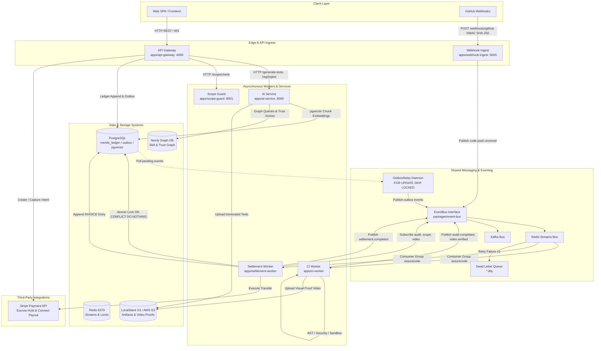
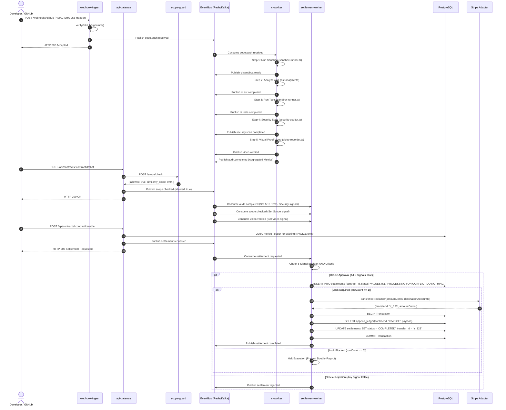

# AssureCode Architectural Overview

> **This document is a historical snapshot and is no longer authoritative.**
> It describes an earlier state of the system. Several mechanisms it details
> have since been replaced — the maintainability index formula, the OWASP
> category coverage, the scope-check mechanism, and the visual-proof signal.
> Corrections are marked inline below.
>
> Two further corrections that apply throughout, added after the Razorpay pivot:
>
> * **Every reference to Stripe describes deleted code.** `packages/stripe-adapter`,
>   `StripeEscrowAdapter`, `createPaymentIntent`, `transferToFreelancer`,
>   `stripe.transfers.create`, `STRIPE_SECRET_KEY` and `FakeEscrowAdapter` no
>   longer exist. Payments are `packages/razorpay-adapter`, which creates an
>   order with `payment_capture: 0` and captures on settlement.
>   **`transferToFreelancer` has no replacement** — capture moves money to the
>   platform and no payout leg exists.
> * **"5-signal oracle" is wrong; it is six.** `packages/oracle` evaluates AST,
>   tests, security, scope, `trustScore >= 85` and `criticalVulns === 0`. There
>   is no video signal — visual proof was withdrawn.
> * **Neo4j claims below were false when written and are only conditionally
>   true now.** This document states that `/match` reads "Neo4j skill graph
>   records" and that `/xai/score` runs `SET f.trust_score = $trust_score`.
>   Neither happened: `get_graph_repo()` had no Neo4j branch at all, so
>   `PostgresGraphRepo` served every request. (The property name is also wrong —
>   it is `XAI_Trust_Score`, not `trust_score`.) As of 2026-08-16 Neo4j *is* a
>   working backend, but only when `GRAPH_BACKEND=neo4j` is set explicitly and
>   only after `tools/seed-neo4j-vectors.py` has built the vector index.
>   Postgres remains the default, so the default path still does not touch Neo4j.
>
> See `ARCHITECTURE.md` at the repository root for the current design.
>
> **The current description is
> [`ASSURECODE_COMPLETE_TECHNICAL_SPECIFICATION.md`](./ASSURECODE_COMPLETE_TECHNICAL_SPECIFICATION.md).**

## 1. High-Level System Overview & Architectural Topology

**AssureCode** is an enterprise-grade, zero-trust autonomous code escrow and automated verification platform. It enforces contractual code quality, safety, and functional guarantees through cryptographic Merkle audit logs, automated 5-signal oracle evaluations, AI-assisted test generation, vector-search scope boundary protection, and 2-phase escrow settlements.

```
                                      +-------------------------------+
                                      |          Web SPA / BFF        |
                                      |      (Next.js / Fastify)      |
                                      +---------------+---------------+
                                                      |
                                                      v
                                        +-------------+-------------+
                                        |        API Gateway        |
                                        |    (Fastify Port 4000)    |
                                        +------+--------------+-----+
                                               |              |
                       +-----------------------+              +------------------------+
                       |                                                               |
                       v                                                               v
      +----------------+---------------+                              +----------------+---------------+
      |         AI Service             |                              |         Webhook Ingest        |
      |   (FastAPI Port 8000)          |                              |    (Fastify Port 9000/3002)   |
      +--------+---------------+                                      +----------------+---------------+
               |                                                                       |
               | (Embeddings/RAG/XAI)                                                  | (GitHub HMAC Webhook)
               v                                                                       v
+--------------+-----------------------+                              +----------------+---------------+
|          Data Storage Layer          |                              |       EventBus Infrastructure  |
|  - PostgreSQL (pgvector, ledger)      |<============================>|   (Redis Streams / Kafka)     |
|  - Neo4j (Skill & Trust Graph)       |                              |   + Transactional Outbox      |
|  - LocalStack S3 (Artifacts & Video) |                              +----------------+---------------+
+--------------------------------------+                                               |
                                                                                       | (code.push.received)
                                                                                       v
                                                                      +----------------+---------------+
                                                                      |           CI Worker           |
                                                                      |  (AST, Tests, Security, Video) |
                                                                      +----------------+---------------+
                                                                                       |
                                                                                       | (audit.completed, etc.)
                                                                                       v
                                                                      +----------------+---------------+
                                                                      |       Settlement Worker       |
                                                                      |     (5-Signal Oracle Engine)   |
                                                                      +----------------+---------------+
                                                                                       |
                                                                                       v
                                                                      +----------------+---------------+
                                                                      |        Stripe Escrow Adapter  |
                                                                      |  (2-Phase Hold & Connect)      |
                                                                      +--------------------------------+
```

### Key Architectural Principles

1. **Hexagonal Architecture & Seams**: Business logic is isolated from external side effects via port interfaces (e.g., `EscrowPort`, `EventBus`, `LedgerClient`). Adapters (e.g., `StripeEscrowAdapter`, `FakeEscrowAdapter`, `RedisStreamsBus`, `KafkaBus`) are dynamically selected based on runtime configuration.
2. **Event-Driven Asynchronous Messaging**: Microservices communicate asynchronously over standard domain events (`EVENT_TOPICS`) using structured envelopes (`EventEnvelope`) containing UUIDs, ISO-8601 timestamps, trace correlation IDs, and W3C OpenTelemetry contexts.
3. **Transactional Outbox Pattern**: State mutations and outbound domain events are atomically written to PostgreSQL in a single database transaction (`append_ledger_and_outbox`). An asynchronous background daemon (`OutboxRelay`) polls the `outbox` table using `SELECT ... FOR UPDATE SKIP LOCKED` and publishes pending events to the EventBus without dual-write race conditions.
4. **Immutable Cryptographic Audit Trail**: Every contract milestone (initialization, locking, test generation, security audits, settlement, escrow actions) is appended to a append-only Merkle chain stored in PostgreSQL (`merkle_ledger`). Each block embeds a SHA-256 hash digest (`current_hash = SHA256(payload + previous_hash)`).
5. **5-Signal Autonomous Oracle**: Settlement payouts to freelancers are governed by a strict multi-signal oracle engine (`settlement-worker`) that requires 100% agreement across 5 automated verification signals (AST Cyclomatic Complexity & Maintainability, Unit/Integration Test Pass Rate, OWASP Security Scan, Chat Scope Compliance, and Visual Proof Video Recording).
6. **Single-Fire Concurrency Guards**: Double-payouts and race conditions during escrow release are prevented using atomic PostgreSQL database locks (`INSERT INTO settlements (contract_id, status) VALUES ($1, 'PROCESSING') ON CONFLICT (contract_id) DO NOTHING`).

---

## 2. High-Level System Architecture Diagram (Mermaid.js)



---

## 3. Explicit Microservices Breakdown (`apps/`)

AssureCode is structured as 5 modular microservices under `apps/`, each possessing clear single-responsibility boundaries, isolated runtime configurations, and standard telemetry exporters.

---

### 3.1 `api-gateway` (`apps/api-gateway/`)

* **Primary Purpose & Business Role**: Backend-For-Frontend (BFF) REST and WebSocket Gateway. It serves as the primary ingress point for client applications, orchestrating contract initialization, test generation triggers, Merkle ledger querying/validation, Stripe escrow initialization, manual settlement triggers, chat scope-checking, and real-time WebSocket state streaming.
* **Entry Point & Server Setup**: 
  * File: `apps/api-gateway/src/server.ts`
  * Framework: Fastify (`fastify` ^5.2.0), `@fastify/cors`, `@fastify/websocket`.
  * Port: `GATEWAY_PORT` (default `4000`).
* **Idempotency & Concurrency Middleware**:
  * File: `apps/api-gateway/src/middleware/idempotency.ts`
  * Mechanism: Implements dual-layer idempotency. Checks the `Idempotency-Key` or `X-Idempotency-Key` headers. First checks an in-memory promise map to coalesce concurrent identical requests, then queries PostgreSQL `idempotency_keys` table. Stored responses are replayed verbatim without re-executing business logic.
* **Routes & Handlers**:
  * `GET /healthz` — Liveness check (`{ status: 'ok', timestamp, version }`).
  * `GET /readyz` — Readiness check (`SELECT 1` on PostgreSQL pool).
  * `GET /metrics` — Prometheus metrics export (`metrics.getMetrics()`).
  * `POST /api/contracts/initialize` — Validates `InitializeContractSchema`, generates contract ID (`AC-...`), publishes `contract.initialized` to EventBus.
  * `POST /api/contracts/:contractId/generate-tests` — Calls `ai-service` `/generate-tests`. Handles HTTP 503 (LLM busy) by enqueuing a background job in Postgres `jobs` table and returning HTTP 202 (`{ jobId, status: 'queued', pollUrl }`). On HTTP 200, appends `TESTS_GENERATED` to Merkle ledger via `appendWithOutbox` and emits `tests.generated`.
  * `POST /api/contracts/:contractId/lock` — Appends `CONTRACT_LOCKED` to Merkle ledger via `appendWithOutbox`, emits `contract.locked`, and triggers async requirement chunking into `ai-service` `/rag/ingest`.
  * `POST /api/contracts/:contractId/escrow` — Interacts with `EscrowPort` to create a 2-phase Stripe PaymentIntent (`capture_method: 'manual'`), appends `ESCROW_CREATED` to Merkle ledger, and logs record in `payment_events`.
  * `POST /api/contracts/:contractId/settle` — Verifies contract is not already settled in `merkle_ledger`, then publishes `settlement.requested`.
  * `POST /webhooks/stripe` — Verifies Stripe webhook HMAC signature via `escrowAdapter.verifyWebhook`; on `payment_intent.succeeded` appends `ESCROW_EVENT` to ledger and emits `contract.locked`.
  * `GET /api/contracts/:contractId` — Fetches full array of ledger rows for contract from Postgres `merkle_ledger`.
  * `GET /api/contracts/:contractId/verify` — Re-derives full SHA-256 Merkle chain via `ledgerClient.verifyChain(contractId)`. Returns HTTP 200 `{ valid: true }` or HTTP 409 `{ valid: false }` if tampered.
  * `GET /api/jobs/:jobId` — Polls status of background test generation jobs.
  * `POST /api/contracts/:contractId/simulate-push` — Simulates GitHub push by publishing `code.push.received` to EventBus.
  * `GET /api/audits/:contractId/results` — Returns latest `AUDIT_COMPLETED` or `CI_PASSED` Merkle ledger record for the contract.
  * `GET /api/contracts/:contractId/score` — Requests XAI Trust Score evaluation from `ai-service` `/xai/score`, appends `XAI_SCORED` to ledger, and emits `xai.scored`.
  * `POST /api/contracts/:contractId/chat` — Intercepts chat messages, calls `scope-guard` `/scope/check`. If blocked (`allowed: false`), emits `scope.checked` and returns HTTP 403. If permitted, emits `scope.checked` and returns HTTP 200.
  * `GET /api/contracts/:contractId/chat/stream` — Fastify WebSocket stream subscribing to `scope.checked` EventBus events and streaming push updates to connected web clients.
* **Event Topics**:
  * **Published**: `contract.initialized`, `tests.generated` (via OutboxRelay), `contract.locked` (via OutboxRelay), `settlement.requested`, `code.push.received`, `xai.scored`, `scope.checked`.
  * **Consumed**: `scope.checked` (relayed over WebSocket connection).
* **Inter-Service Dependencies**: Calls `ai-service` (`http://localhost:8000`), `scope-guard` (`http://localhost:8001`), PostgreSQL, Redis Streams / Kafka, and LocalStack/AWS S3.

---

### 3.2 `ci-worker` (`apps/ci-worker/`)

* **Primary Purpose & Business Role**: Asynchronous, event-driven zero-trust CI pipeline worker. Consumes `code.push.received` events and executes a 6-stage automated analysis pipeline: isolated sandbox provisioning, AST maintainability index analysis, hidden test suite execution, OWASP security scanning, visual proof video generation, and telemetry aggregation.
* **Entry Point & Architecture**:
  * File: `apps/ci-worker/src/worker.ts`
  * Execution: Standalone event-driven daemon (`node dist/worker.js`).
  * Internal Modules: `src/sandbox-runner.ts`, `src/ast-analyzer.ts`, `src/security-auditor.ts`, `src/video-recorder.ts`.
* **Pipeline Execution Steps**:
  1. **Sandbox Initialization** (`sandbox-runner.ts`): Executes `docker run --rm --network=none --memory=512m --cpus=1 alpine:latest` (with isolated process fallback). Emits `ci.sandbox.ready`.
  2. **AST Static Analysis** (`ast-analyzer.ts`): Scans JS/TS code decision points (`if`, `for`, `while`, `catch`, `case`, `&&`, `||`, `?`) to calculate cyclomatic complexity and the Maintainability Index. Emits `ci.ast.completed`.
     > **Corrected.** The formula quoted here previously — `100 - avgComplexity * 10 - lineCount * 0.5` — was invented, and the analyzer used regex rather than a parser (a branch-free line scored 38 decision points). Both are replaced: `@babel/parser` traversal, and the published SEI index `max(0, (171 − 5.2·ln V − 0.23·M − 16.2·ln L)/171 × 100)`.
  3. **Test Suite Execution**: Runs test suite against codebase inside sandbox, recording `passedTests` and `totalTests`. Emits `ci.tests.completed`.
  4. **OWASP Security Audit** (`security-auditor.ts`): Scans codebase for 4 vulnerability classes: Hardcoded Secrets, Dynamic Code Execution (`eval`/`Function`), SQL Injection, and Command Injection (`child_process.exec`). Calculates security score (`100 - critical * 40 - high * 20 - total * 5`). Emits `security.scan.completed`.
  5. ~~**Visual Proof Video Capture** (`video-recorder.ts`)~~
     > **Removed.** `video-recorder.ts` and the `video.verified` signal have been deleted. The module returned `verified: true` unconditionally and hashed a string rather than a recording, and no architectural objective required it.
  6. **Telemetry Aggregation**: Aggregates all results into an `auditResults` payload and emits `audit.completed`.
* **Event Topics**:
  * **Consumed**: `code.push.received`.
  * **Published**: `ci.sandbox.ready`, `ci.ast.completed`, `ci.tests.completed`, `security.scan.completed`, `video.verified`, `audit.completed`.
* **Storage Access**: Uploads visual proof video files to LocalStack S3 (`http://localhost:4566/assurecode-test-bundles`).

---

### 3.3 `settlement-worker` (`apps/settlement-worker/`)

* **Primary Purpose & Business Role**: Autonomous 5-Signal Oracle Escrow Settlement Engine. Consumes validation events across all 5 verification signals, maintains an in-memory oracle state matrix per contract, evaluates strict Boolean settlement conditions, acquires single-fire database guards to prevent double-payouts, executes Stripe transfers, and atomically writes `INVOICE` records to the Merkle ledger.
* **Entry Point & Server Setup**:
  * File: `apps/settlement-worker/src/worker.ts`
  * Execution: Standalone event-driven consumer process subscribing to `EVENT_TOPICS`.
* **5-Signal Oracle State Matrix**:
  Maintain an in-memory state object `ContractOracleState` per contract ID containing:
  * `astPassed`: `Number(payload.auditResults.maintainability) >= 10`
  * `testsPassed`: `passedTests === totalTests && totalTests > 0`
  * `securityPassed`: `vulnerabilities === 0`
  * `scopePassed`: `allowed === true` (from `scope.checked`)
  * `videoPassed`: `true` (from `video.verified`)
* **Strict Boolean AND Settlement Criteria**:
  ```typescript
  const isApproved = state.astPassed && state.testsPassed && state.securityPassed && state.scopePassed && state.videoPassed;
  ```
* **Single-Fire Concurrency Lock**:
  Prevents double-payout race conditions using PostgreSQL atomic `INSERT ... ON CONFLICT DO NOTHING`:
  ```sql
  INSERT INTO settlements (contract_id, status)
  VALUES ($1, 'PROCESSING')
  ON CONFLICT (contract_id) DO NOTHING
  RETURNING contract_id;
  ```
  If `rowCount !== 1`, lock acquisition fails and execution halts immediately.
* **Stripe Escrow Release & Ledger Atomic Append**:
  Upon lock acquisition, invokes `escrowAdapter.transferToFreelancer(...)`, opens a PostgreSQL transaction (`BEGIN`), appends `INVOICE` entry to `merkle_ledger` via `LedgerClient`, updates settlement status to `'COMPLETED'`, commits (`COMMIT`), and emits `settlement.completed`.
* **Event Topics**:
  * **Consumed**: `audit.completed`, `scope.checked`, `video.verified`, `settlement.requested`.
  * **Published**: `settlement.completed`, `settlement.rejected`.

---

### 3.4 `webhook-ingest` (`apps/webhook-ingest/`)

* **Primary Purpose & Business Role**: High-throughput edge ingress service for GitHub webhooks. Performs constant-time HMAC SHA-256 signature verification, parses repository and commit metadata, binds trace correlation IDs, and publishes normalized `code.push.received` events to the EventBus.
* **Entry Point & Server Setup**:
  * File: `apps/webhook-ingest/src/server.ts`
  * Framework: Fastify (^5.2.0) with custom raw body buffer content-type parser.
  * Port: `WEBHOOK_INGEST_PORT` (default `9000` or `3002`).
* **HMAC Signature Verification Logic**:
  Uses `crypto.timingSafeEqual` against header `x-hub-signature-256` and secret `GITHUB_WEBHOOK_SECRET`:
  ```typescript
  export function verifyGitHubSignature(payload: string | Buffer, signatureHeader: string, secret: string): boolean {
    if (!signatureHeader || !signatureHeader.startsWith('sha256=')) return false;
    const signature = signatureHeader.slice(7);
    const hmac = crypto.createHmac('sha256', secret);
    hmac.update(payload);
    const expectedSignature = hmac.digest('hex');
    try {
      return crypto.timingSafeEqual(Buffer.from(signature, 'hex'), Buffer.from(expectedSignature, 'hex'));
    } catch {
      return false;
    }
  }
  ```
* **Routes & Endpoints**:
  * `GET /healthz` — Liveness probe.
  * `GET /readyz` — Readiness probe.
  * `GET /metrics` — Prometheus metrics export.
  * `POST /webhooks/github` — Validates HMAC SHA-256 header. On valid signature, extracts `contractId`, `commitHash`, `repoUrl`, `ref`, `pusher`, publishes `code.push.received` to EventBus, and returns HTTP 202 Accepted.
* **Event Topics**:
  * **Published**: `code.push.received`.
  * **Consumed**: None.

---

### 3.5 `ai-service` (`apps/ai-service/`)

* **Primary Purpose & Business Role**: Intelligence microservice written in Python (FastAPI). Provides vector text embeddings, candidate freelancer NLP matchmaker ranking, contract chunking and RAG ingestion using `pgvector`, LLM Jest/Cypress test bundle generation with S3 storage, and Explainable AI (XAI) trust score calculation with Neo4j graph updates.
* **Entry Point & Architecture**:
  * Entry Point: `apps/ai-service/app/main.py` (FastAPI app running on port 8000 via Uvicorn).
  * Architecture: Hexagonal architecture with abstract ports in `app/ports/` (`embedder.py`, `graph_repo.py`, `llm_client.py`, `rag_store.py`, `artifact_store.py`), adapters in `app/adapters/`, and dependency injection container in `app/deps.py`.
* **Routes & Endpoints**:
  * `GET /healthz` — Service health probe.
  * `POST /embed` & `POST /embed/batch` — Generates 384-dimensional vector embeddings using `SentenceTransformerEmbedder` (`all-MiniLM-L6-v2`) or `FakeEmbedder` fallback.
  * `POST /match` — Ranks freelancers against job requirements using cosine vector similarity, Neo4j skill graph records, trust score, and historical delivery counts.
  * `POST /rag/ingest` — Chunks contract requirement text via paragraph packing, embeds chunks in batch, and persists into PostgreSQL using `pgvector` (`PostgresRagStore`).
  * `GET /rag/count/{contract_id}` — Returns count of vector chunks for contract.
  * `POST /generate-tests` — Invokes Gemini (`GeminiClient`) or OpenAI (`OpenAIClient`) to generate unit/integration test code, uploads test bundle to S3 (`S3ArtifactStore`), and returns S3 URL. Returns HTTP 503 with `Retry-After` header when LLM quota is exhausted.
  * `POST /xai/score` — Calculates weighted XAI Trust Score (40% test pass rate, 25% maintainability index, 20% security score, 15% sentiment analysis), updates Neo4j freelancer node (`SET f.trust_score = $trust_score`), and returns score with itemized justifications.
* **Storage Dependencies**: PostgreSQL with `pgvector` extension, Neo4j Graph DB (`bolt://localhost:7687`), and LocalStack/AWS S3 (`http://localhost:4566`).

---

## 4. Explicit Shared Packages Breakdown (`packages/`)

```
packages/
├── config/           # Zod app config, Pino logger, environment defaults
├── event-bus/        # Pub/Sub interfaces, Redis Streams, Kafka, OutboxRelay
├── ledger-client/    # SHA-256 Merkle chain client, stored procedures, verifyChain
├── shared/           # EVENT_TOPICS constants, Zod DTO & Envelope schemas
├── stripe-adapter/   # EscrowPort, 2-phase PaymentIntents, FakeEscrowAdapter
└── telemetry/        # OpenTelemetry, AsyncLocalStorage correlation, Prometheus metrics
```

---

### 4.1 `packages/event-bus` (`@assurecode/event-bus`)

* **Primary Purpose**: Production-ready event-driven messaging abstraction supporting Redis Streams, Apache Kafka, and In-Memory transport implementations with OpenTelemetry context propagation, exponential backoff retries, Dead Letter Queues (DLQ), and Transactional Outbox synchronization.
* **Core Interface & Envelope Structure**:
  ```typescript
  export interface EventEnvelope {
    id: string; // UUID v4
    topic: string;
    timestamp: string; // ISO 8601
    correlationId: string;
    payload: Record<string, unknown>; // Includes _traceContext W3C headers
  }
  ```
* **Transport Implementations**:
  1. **`RedisStreamsBus`**: Uses Redis Streams (`ioredis`). Emits events via `XADD`. Consumer groups register via `XGROUP CREATE ... MKSTREAM` and process events using `XREADGROUP` (`GROUP assurecode`).
  2. **`KafkaBus`**: Uses `kafkajs` Producer/Consumer with `groupId: assurecode-${topic}` and partition keys set to `correlationId`.
  3. **`InMemoryBus`**: Event listener Map for unit tests and offline dev.
* **Retry Mechanism & Dead Letter Queue (DLQ)**:
  * In `RedisStreamsBus.poll()`: Retries failing handlers up to `maxRetries = 3` with exponential backoff (100ms, 200ms).
  * On 3rd failure, forwards the envelope to Dead Letter Queue stream `${topic}.dlq` containing error stack, original stream ID, and retry attempts.
  * Increments `metrics.dlqDepth` and acknowledges (`XACK`) message on primary stream to prevent consumer blocking.
* **Transactional Outbox Daemon (`OutboxRelay`)**:
  * File: `packages/event-bus/src/outbox-relay.ts`
  * Class: `OutboxRelay`
  * Query: Polls `outbox` table using row locking:
    ```sql
    SELECT outbox_id, topic, payload, correlation_id
    FROM outbox
    WHERE sent_at IS NULL
    ORDER BY created_at ASC
    LIMIT $1
    FOR UPDATE SKIP LOCKED;
    ```
  * Execution: Publishes each item to `EventBus` and updates `sent_at = NOW()` in PostgreSQL within a transaction.

---

### 4.2 `packages/ledger-client` (`@assurecode/ledger-client`)

* **Primary Purpose**: Client interface for PostgreSQL append-only Merkle ledger. Guarantees tamper-evident audit logs using SHA-256 chain digests, outbox staging, and chain integrity verification routines.
* **PostgreSQL Schema & Stored Procedures**:
  * Table: `merkle_ledger` (`ledger_id`, `contract_id`, `action_type`, `payload`, `previous_hash`, `current_hash`, `created_at`).
  * Stored Procedure `append_ledger`: Fetches latest hash for contract (or `'GENESIS'`), computes `current_hash = SHA256(JSON.stringify(payload) + previous_hash)`, inserts row, and returns newly inserted row as JSONB.
  * Stored Procedure `append_ledger_and_outbox`: Invokes `append_ledger` and inserts event into `outbox` table in a single atomic SQL call.
* **JS/TS Hash Calculation & Verification Logic**:
  * `calculateSha256(payload, previousHash)` helper:
    ```typescript
    function calculateSha256(payload: Record<string, unknown>, previousHash: string): string {
      const serialized = JSON.stringify(payload) + previousHash;
      return createHash('sha256').update(serialized, 'utf8').digest('hex');
    }
    ```
  * `verifyChain(contractId: string): Promise<boolean>`:
    * Queries `merkle_ledger` ordered by `ledger_id ASC`.
    * Re-evaluates SHA-256 digest in PostgreSQL (`encode(digest((to_jsonb(payload) || to_jsonb(previous_hash))::text, 'sha256'), 'hex')`).
    * Falls back to JS-based hash recalculation loop if SQL digest extension is unavailable.
    * Returns `true` if chain is intact, `false` if any row is tampered, deleted, or reordered.
* **Core API Methods**:
  * `append(contractId, actionType, payload, client?)`: Executes `SELECT append_ledger(...)`.
  * `appendWithOutbox(contractId, actionType, ledgerPayload, eventTopic, eventPayload, correlationId)`: Executes `SELECT append_ledger_and_outbox(...)` with JS transaction fallback (`BEGIN` -> `append_ledger` -> `INSERT INTO outbox` -> `COMMIT`).
  * `getChain(contractId)`: Returns complete ordered ledger rows.
  * `verifyChain(contractId)`: Cryptographic verification of contract chain.

---

### 4.3 `packages/stripe-adapter` (`@assurecode/stripe-adapter`)

* **Primary Purpose**: Hexagonal payment port adapter providing 2-phase escrow hold and transfer capabilities via Stripe API, with automatic fallback to a deterministic mock adapter (`FakeEscrowAdapter`).
* **`EscrowPort` Interface**:
  ```typescript
  export interface EscrowPort {
    createPaymentIntent(params: { amountCents: number; contractId: string; metadata?: Record<string, string> }): Promise<PaymentIntentResult>;
    capturePaymentIntent(paymentIntentId: string): Promise<PaymentIntentResult>;
    cancelPaymentIntent(paymentIntentId: string): Promise<{ canceled: boolean; paymentIntentId: string }>;
    verifyWebhook(payload: string | Buffer, signature: string): Promise<WebhookVerificationResult>;
    transferToFreelancer(params: { amountCents: number; destinationAccountId: string; contractId: string }): Promise<{ transferId: string; amountCents: number }>;
  }
  ```
* **2-Phase Escrow Lifecycle**:
  1. **Escrow Creation**: `createPaymentIntent` calls `stripe.paymentIntents.create` with `capture_method: 'manual'`, reserving buyer funds without immediate capture.
  2. **Escrow Capture**: `capturePaymentIntent` executes `stripe.paymentIntents.capture(id)` upon contract settlement approval.
  3. **Escrow Cancellation**: `cancelPaymentIntent` executes `stripe.paymentIntents.cancel(id)` upon contract rejection or cancellation.
  4. **Freelancer Transfer**: `transferToFreelancer` executes `stripe.transfers.create` targeting freelancer Stripe Connect account.
* **Factory Pattern & Fallback**:
  * `createEscrowAdapter(config)`: Checks if `secretKey` is absent, invalid, or `isTest === true`. Returns `FakeEscrowAdapter` for local development and offline environments, producing fake deterministic IDs (`pi_fake_...`, `tr_fake_...`).

---

### 4.4 `packages/shared` (`@assurecode/shared`)

* **Primary Purpose**: Single source of truth for domain constants, 17 pub/sub event topics (`EVENT_TOPICS`), and Zod validation DTO schemas.
* **`EVENT_TOPICS` Constants**:
  ```typescript
  export const EVENT_TOPICS = {
    CONTRACT_INITIALIZED: 'contract.initialized',
    CONTRACT_LOCKED: 'contract.locked',
    CODE_PUSH_RECEIVED: 'code.push.received',
    CI_SANDBOX_READY: 'ci.sandbox.ready',
    CI_AST_COMPLETED: 'ci.ast.completed',
    CI_TESTS_COMPLETED: 'ci.tests.completed',
    SECURITY_SCAN_COMPLETED: 'security.scan.completed',
    AUDIT_COMPLETED: 'audit.completed',
    TESTS_GENERATED: 'tests.generated',
    SCOPE_CHECKED: 'scope.checked',
    VIDEO_VERIFIED: 'video.verified',
    XAI_SCORED: 'xai.scored',
    SETTLEMENT_REQUESTED: 'settlement.requested',
    SETTLEMENT_REJECTED: 'settlement.rejected',
    SETTLEMENT_COMPLETED: 'settlement.completed',
    ESCROW_LOCKED: 'escrow.locked',
    PAYMENT_FAILED: 'payment.failed',
  } as const;
  ```
* **Exported Zod Schemas**: `EventEnvelopeSchema`, `InitializeContractSchema`, `ContractSchema`, `ContractLockedSchema`, `TestsGeneratedSchema`, `AuditResultsSchema`, `LedgerEntrySchema`, `PipelineStepSchema`, `ScopeCheckResultSchema`, `SettlementRequestedSchema`, `SettlementCompletedSchema`, `SettlementRejectedSchema`, `IdempotencyKeyHeaderSchema`.

---

### 4.5 `packages/config` & `packages/telemetry` (`@assurecode/config`, `@assurecode/telemetry`)

* **`packages/config`**:
  * Defines `AppConfigSchema` validating all environment variables (`NODE_ENV`, `LOG_LEVEL`, `POSTGRES_*`, `REDIS_URL`, `NEO4J_*`, service ports, Stripe keys, S3 credentials).
  * Exposes `createLogger()` producing Pino structured logs enriched with correlation IDs retrieved from `@assurecode/telemetry` / `AsyncLocalStorage`.
* **`packages/telemetry`**:
  * Implements Node.js OpenTelemetry SDK initialization (`initTelemetry`, `initTracing`).
  * Propagates trace context across microservice boundaries via HTTP headers (`x-correlation-id`) and event envelope fields (`_traceContext`).
  * Exports Prometheus registry (`metricsRegistry`) tracking key operational metrics:
    * `assurecode_ledger_appends_total` (Counter)
    * `assurecode_event_bus_lag_seconds` (Histogram)
    * `assurecode_settlement_amount_cents_total` (Counter)
    * `assurecode_dlq_depth` (Gauge)
    * `assurecode_ci_sandbox_duration_seconds` (Histogram)
    * `assurecode_llm_request_duration_seconds` (Histogram)

---

## 5. Detailed Data Flow: The 5-Signal Settlement Process

The core innovation of AssureCode is its **Autonomous 5-Signal Oracle Escrow Settlement Process**. Payouts are triggered only when all 5 validation signals pass strict evaluation thresholds.

```
       +------------------------------------------------------------------+
       |                  5-SIGNAL ORACLE EVALUATION MATRIX               |
       +------------------------------------------------------------------+
       |  Signal 1: AST Maintainability Index  => Maintainability >= 10   |
       |  Signal 2: Test Suite Pass Rate       => 100% Pass Rate         |
       |  Signal 3: OWASP Security Audit       => 0 Vulnerabilities       |
       |  Signal 4: Chat Scope Compliance      => Allowed == true         |
       |  Signal 5: Visual Proof Video         => Video Verified == true  |
       +------------------------------------------------------------------+
                                        |
                                        v
                 Strict Boolean AND:  Is All 5 Signals Passed?
                                   /         \
                             YES  /           \  NO
                                 v             v
                       Execute Lock        Reject Settlement
                       Stripe Transfer     Publish Rejected Event
                       Append Ledger INVOICE
```

---

### 5.1 Comprehensive Signal Breakdown

| Signal Name | Generation & Computation Source | Computation Metric & Formula | Direct / Aggregated Event Topic | Oracle Evaluation Threshold in `settlement-worker` | Weighting in XAI Trust Score (`ai-service`) |
|---|---|---|---|---|---|
| **1. AST Signal** | `apps/ci-worker/src/ast-analyzer.ts` | Scans JS/TS decision keywords (`if`, `for`, `while`, `catch`, `case`, `&&`, `||`, `?`). Calculates cyclomatic complexity and Maintainability Index: `100 - avgComplexity * 10 - lineCount * 0.5`, clamped `[10, 100]`. | Direct: `ci.ast.completed`<br>Aggregated: `audit.completed` | `Number(maintainability) >= 10` | **25%** (`0.25 * (maintainability / 100.0)`) |
| **2. Tests Signal** | `apps/ci-worker/src/sandbox-runner.ts` | Executes test suite in Docker container (`alpine:latest` with `--memory=512m --cpus=1`). Returns `passedTests` and `totalTests`. | Direct: `ci.tests.completed`<br>Aggregated: `audit.completed` | `passedTests === totalTests && totalTests > 0` (100% pass rate) | **40%** (`0.40 * (passedTests / totalTests)`) |
| **3. Security Signal** | `apps/ci-worker/src/security-auditor.ts` | OWASP static scan across 4 vulnerability classes: Hardcoded Secrets, Dynamic Code (`eval`/`Function`), SQLi, Command Injection. Score: `100 - critical * 40 - high * 20 - total * 5`. | Direct: `security.scan.completed`<br>Aggregated: `audit.completed` | `vulnerabilities === 0` | **20%** (`0.20 * (1.0 if vuln == 0 else max(0, 1 - vuln * 0.25))`) |
| **4. Scope Signal** | `apps/scope-guard/app/main.py` & `apps/api-gateway/src/server.ts` | Resolves the contract's genesis ledger hash $H_0$, then retrieves top-k contract chunks by `pgvector` cosine similarity and compares the best match against the calibrated threshold 0.2731. Decisions are recorded against $H_0$. | `scope.checked` | `allowed === true` | Feeds $S_{\text{scope}}$ (15%) |
| | | > **Corrected.** The regex phrase list described here ("unpaid", "for free", "overhaul") returned literal similarity values of 0.32/0.89 and has been deleted. It performed no embedding and no retrieval. | | | |
| ~~**5. Video Signal**~~ | *removed* | Deleted — returned `verified: true` without doing the work. The oracle now gates on `trustScore >= 85 && criticalVulns === 0`, defined once in `packages/oracle`. | — | — | — |

---

### 5.2 Aggregation & Strict Boolean AND Evaluation

In `apps/settlement-worker/src/worker.ts`, incoming events update an in-memory oracle store `oracleStore.get(contractId)`:

```typescript
// Signal 1, 2, 3 Ingestion (from audit.completed)
state.astPassed = Number(payload.auditResults.maintainability) >= 10;
state.testsPassed = Number(payload.auditResults.passedTests) === Number(payload.auditResults.totalTests) && Number(payload.auditResults.totalTests) > 0;
state.securityPassed = Number(payload.auditResults.vulnerabilities) === 0;

// Signal 4 Ingestion (from scope.checked)
state.scopePassed = payload.allowed === true;

// Signal 5 Ingestion (from video.verified)
state.videoPassed = payload.verified === true;
```

Upon receiving `settlement.requested`, the oracle evaluates:

```typescript
const isApproved = state.astPassed && state.testsPassed && state.securityPassed && state.scopePassed && state.videoPassed;
```

---

## 6. 5-Signal Settlement Sequence Diagram (Mermaid.js)



---

## 7. Cryptographic Ledger Integrity, Single-Fire Locks, and Stripe Mechanics

### 7.1 Cryptographic Merkle Ledger Integrity Guarantees

The AssureCode Merkle ledger (`merkle_ledger`) enforces cryptographically verifiable immutability:

1. **Hash Chain Derivation**:
   Every row $i$ in `merkle_ledger` derives its current hash digest using:
   $$\text{current\_hash}_i = \text{SHA256}(\text{JSON.stringify}(\text{payload}_i) + \text{current\_hash}_{i-1})$$
   For the genesis entry ($i = 1$), $\text{current\_hash}_0 = \text{'GENESIS'}$.

2. **PostgreSQL Stored Procedure Mechanics**:
   `append_ledger` performs hash computation directly inside PostgreSQL using the `pgcrypto` extension:
   ```sql
   CREATE OR REPLACE FUNCTION append_ledger(
     p_contract_id TEXT,
     p_action_type TEXT,
     p_payload JSONB
   ) RETURNS JSONB AS $$
   DECLARE
     v_prev_hash TEXT;
     v_curr_hash TEXT;
     v_row RECORD;
   BEGIN
     SELECT current_hash INTO v_prev_hash
     FROM merkle_ledger
     WHERE contract_id = p_contract_id
     ORDER BY ledger_id DESC LIMIT 1;

     IF v_prev_hash IS NULL THEN
       v_prev_hash := 'GENESIS';
     END IF;

     v_curr_hash := encode(digest((p_payload::text || v_prev_hash), 'sha256'), 'hex');

     INSERT INTO merkle_ledger (contract_id, action_type, payload, previous_hash, current_hash)
     VALUES (p_contract_id, p_action_type, p_payload, v_prev_hash, v_curr_hash)
     RETURNING * INTO v_row;

     RETURN to_jsonb(v_row);
   END;
   $$ LANGUAGE plpgsql;
   ```

3. **Tamper Verification (`verifyChain`)**:
   `ledgerClient.verifyChain(contractId)` fetches all rows for a contract sorted by `sequence_number ASC` and re-computes every SHA-256 hash link. If an attacker modifies any historical payload, deletes a row, or inserts an out-of-order entry, `verifyChain` fails, returning `false` and triggering alerting metrics.

---

### 7.2 Single-Fire Concurrency Lock (`settlements` Table)

To protect against duplicate escrow releases during concurrent `settlement.requested` events, `settlement-worker` relies on PostgreSQL unique key conflict resolution:

* **Table Definition**:
  ```sql
  CREATE TABLE IF NOT EXISTS settlements (
    contract_id VARCHAR(255) PRIMARY KEY,
    status VARCHAR(50) NOT NULL,
    transfer_id VARCHAR(255),
    created_at TIMESTAMP WITH TIME ZONE DEFAULT NOW(),
    updated_at TIMESTAMP WITH TIME ZONE DEFAULT NOW()
  );
  ```

* **Atomic Concurrency Primitive**:
  ```typescript
  const guardRes = await dbPool.query(
    `INSERT INTO settlements (contract_id, status)
     VALUES ($1, 'PROCESSING')
     ON CONFLICT (contract_id) DO NOTHING
     RETURNING contract_id`,
    [contractId]
  );

  if (!guardRes || guardRes.rowCount !== 1) {
    // Lock acquisition failed — another worker instance is processing or completed settlement
    logger.warn({ contractId }, 'Settlement lock acquisition rejected (duplicate attempt)');
    return;
  }
  ```

---

### 7.3 Stripe Escrow 2-Phase Hold & Transfer Flow

The payment workflow uses Stripe PaymentIntents with manual capture:

```
[Contract Escrow Init] ---> Stripe PaymentIntent (capture_method: 'manual')
                                     |
                                     v
                        Funds Reserved in Stripe Escrow
                                     |
                      +--------------+--------------+
                      |                             |
                      v                             v
           [Oracle All 5 Signals Pass]    [Oracle Rejection / Cancel]
                      |                             |
                      v                             v
           1. Capture PaymentIntent       1. Cancel PaymentIntent
           2. Stripe Connect Transfer        (Funds Released to Buyer)
              to Freelancer Account
```

1. **Escrow Hold**: Calling `escrowAdapter.createPaymentIntent` creates a PaymentIntent with `capture_method: 'manual'`. Funds are authorized and held in escrow without immediate settlement.
2. **Escrow Capture & Payout**: Upon 5-signal oracle approval, `settlement-worker` calls `escrowAdapter.transferToFreelancer`, executing a Stripe Connect transfer (`stripe.transfers.create`) to the freelancer's account (`destinationAccountId`).
3. **Escrow Cancellation**: If contract terms fail or contract is cancelled, `escrowAdapter.cancelPaymentIntent` releases the hold, returning funds to the buyer.
4. **Environment Determinism**: When `STRIPE_SECRET_KEY` is omitted or in test mode, `createEscrowAdapter` loads `FakeEscrowAdapter`, enabling full offline end-to-end execution without external Stripe network calls.

---

## 8. Comprehensive Architecture File Index

| Directory / File Path | Architectural Component | Purpose & Description |
|---|---|---|
| `apps/api-gateway/src/server.ts` | Microservice (`api-gateway`) | Fastify REST/WS Gateway entry point, route definitions, RAG ingest trigger, Stripe webhooks, job status. |
| `apps/api-gateway/src/middleware/idempotency.ts` | Middleware | Dual-layer memory + PostgreSQL idempotency key caching. |
| `apps/ci-worker/src/worker.ts` | Microservice (`ci-worker`) | Standalone event consumer process executing 6-step CI verification pipeline. |
| `apps/ci-worker/src/ast-analyzer.ts` | CI Module | AST decision point parser & maintainability index calculator. |
| `apps/ci-worker/src/sandbox-runner.ts` | CI Module | Docker container sandbox process runner. |
| `apps/ci-worker/src/security-auditor.ts` | CI Module | OWASP static vulnerability scanner (secrets, eval, SQLi, cmd injection). |
| ~~`apps/ci-worker/src/video-recorder.ts`~~ | *deleted* | Removed — returned `verified: true` and hashed a string, not a recording. |
| `apps/settlement-worker/src/worker.ts` | Microservice (`settlement-worker`) | 5-Signal Oracle settlement engine, single-fire lock, Stripe transfer, Merkle invoice writer. |
| `apps/webhook-ingest/src/server.ts` | Microservice (`webhook-ingest`) | Ingestion gateway for GitHub webhooks with HMAC SHA-256 verification. |
| `apps/ai-service/app/main.py` | Microservice (`ai-service`) | FastAPI entry point for NLP matchmaker, RAG, LLM test generation, XAI trust score. |
| `apps/ai-service/app/routes/xai.py` | AI Route | Weighted XAI trust score calculator (40% tests, 25% AST, 20% security, 15% sentiment) + Neo4j updater. |
| `apps/scope-guard/app/main.py` | Service (`scope-guard`) | Python FastAPI scope boundary checker using vector similarity & pattern matching. |
| `packages/event-bus/src/index.ts` | Shared Package | `EventBus` interface, `RedisStreamsBus` (with DLQ), `KafkaBus`, `InMemoryBus`. |
| `packages/event-bus/src/outbox-relay.ts` | Shared Package | Transactional Outbox background daemon (`FOR UPDATE SKIP LOCKED`). |
| `packages/ledger-client/src/index.ts` | Shared Package | Merkle ledger client, `append_ledger_and_outbox`, SHA-256 chain `verifyChain`. |
| `packages/stripe-adapter/src/index.ts` | Shared Package | `EscrowPort` interface, 2-phase PaymentIntents, `StripeEscrowAdapter`, `FakeEscrowAdapter`. |
| `packages/shared/src/index.ts` | Shared Package | Single source of truth for 17 `EVENT_TOPICS` and Zod validation DTO schemas. |
| `packages/config/src/index.ts` | Shared Package | Environment variable validation via Zod, Pino logging with correlation ID. |
| `packages/telemetry/src/index.ts` | Shared Package | OpenTelemetry tracing setup, `AsyncLocalStorage` correlation ID context, Prometheus metrics. |
